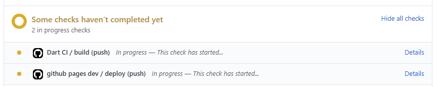
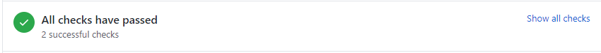

# Contributing to the scadnano web interface

First off, thanks for taking the time to contribute!

The following is a set of guidelines for contributing to scadnano.
Feel free to propose changes to this document in a pull request,
or post questions as issues on the [issues page](https://github.com/UC-Davis-molecular-computing/scadnano/issues).

## Table of contents

- [Contributing to the scadnano web interface](#contributing-to-the-scadnano-web-interface)
  - [Table of contents](#table-of-contents)
  - [What should I know before I get started?](#what-should-i-know-before-i-get-started)
    - [Dart](#dart)
    - [Packages](#packages)
  - [Required reading and intro to scadnano architecture](#required-reading-and-intro-to-scadnano-architecture)
    - [Required reading: Dart](#required-reading-dart)
    - [git](#git)
    - [Required reading: Libraries](#required-reading-libraries)
    - [Immutability](#immutability)
    - [unidirectional data flow architecture of scadnano](#unidirectional-data-flow-architecture-of-scadnano)
  - [Making contributions](#making-contributions)
    - [Cloning](#cloning)
    - [Installing Dart](#installing-dart)
    - [Installing `webdev`](#installing-webdev)
    - [Running a Local Server](#running-a-local-server)
    - [Running Tests](#running-tests)
    - [Formatting Dart code](#formatting-dart-code)
    - [Building](#building)
    - [Troubleshooting](#troubleshooting)
  - [General recipe for adding features](#general-recipe-for-adding-features)
  - [Pushing to the repository dev branch and documenting changes (done on all updates)](#pushing-to-the-repository-dev-branch-and-documenting-changes-done-on-all-updates)
  - [Pushing to the repository main branch and documenting changes (done less frequently)](#pushing-to-the-repository-main-branch-and-documenting-changes-done-less-frequently)
  - [Styleguide](#styleguide)

## What should I know before I get started?

### Dart

scadnano is written in [Dart](https://dart.dev/). You will need to
[get the Dart SDK](https://dart.dev/get-dart) to develop.

### Packages

scadnano uses many packages, all of which can be found in the
[pubspec.yaml](pubspec.yaml) file.
These packages can be installed using [`pub get`](https://dart.dev/guides/packages#getting-packages).

Here's a list of the big ones:

- [OverReact](https://pub.dev/packages/over_react) - A Dart wrapper
  around the JavaScript [React](https://reactjs.org/) and [React Redux](https://react-redux.js.org/)
  libraries and is responsible for the [_view_](lib/src/view)
  component of the application.

- [redux.dart](https://pub.dev/packages/redux) - A Dart wrapper
  around the JavaScript [Redux](https://redux.js.org/) and is
  responsible for the [_state_](lib/src/state),
  [_reducers_](lib/src/reducers), [_action_](lib/src/actions),
  and [_middleware_](lib/src/middleware)
  components of the application.

- [built_value](https://pub.dev/packages/built_value),
  [built_collection](https://pub.dev/packages/built_collection) -
  Immutable values and collections to aid with the [immutability
  required by Redux](https://redux.js.org/faq/immutable-data#why-is-immutability-required-by-redux)

There are many more, but this ones listed here should be sufficient
to implement most features.

## Required reading and intro to scadnano architecture

### Required reading: Dart

The scadnano web interface is written mostly in Dart. So it's obviously a good idea to read through the [Dart documentation](https://dart.dev/guides) a bit. Everyone learns new languages a bit differently, so depending on your style, it might be good to go through their tutorials and write a bit of independent Dart code first, or you might find just diving into scadnano itself works better for you to learn by example.

### git

We use [git](https://git-scm.com/docs/gittutorial) and [GitHub](https://guides.github.com/activities/hello-world/). You can use the command-line git, or a GUI such as [GitHub desktop](https://desktop.github.com/), which is very easy to use and supports the most common git commands, but it is not fully-featured, so you may want another [git client](https://www.google.com/search?q=git+client) if you prefer not to use the command line.

### Required reading: Libraries

It is a good idea first to read through the documentation on

- [React](https://reactjs.org/docs/hello-world.html)
- [Redux](https://redux.js.org/introduction/three-principles)
- [React-Redux bindings](https://react-redux.js.org/introduction/why-use-react-redux)
- [built_value](https://pub.dev/packages/built_value)
- [built_collection](https://pub.dev/packages/built_collection)

Unfortunately, only built_value and built_collection are Dart libraries. React and Redux are both Javascript libraries, so their documentation, while useful, doesn't tell you how to do things in Dart as they are done in scadnano.

[OverReact](https://pub.dev/packages/over_react) and [redux.dart](https://pub.dev/packages/redux) are Dart wrapper libraries for the Javascript libraries. Unfortunately they do not have self-contained documentation. Their documentation is written assuming the user knows Javascript and can easily translate Javascript examples to Dart. In fact, one of the very first instructions in the [OverReact documentation](https://github.com/Workiva/over_react/#anatomy-of-an-overreact-component) is to go read the [React JS tutorial](https://reactjs.org/docs/getting-started.html). So the best way to learn is to bounce between them, realizing that the React and Redux documentation will describe the basic structure correctly, but the detailed way of implementing things is different between Javascript React and Dart OverReact.

### Immutability

The objects implementing what is called _state_ below are immutable, and we use the built_value and built_collection libraries to maintain immutability and get some nice features (such as automatic equality comparison, automatic JSON serialization). When an object is immutable, no changes can be made to it. When you think you want to change an object, what you really want to do is to make a new object that is just like the old object, except in the place(s) you want to change.

This seems as though it would be very memory expensive, but implemented correctly, it's fairly efficient. For example, if you have a large object tree and want to change one subtree of it, then most of the old subtrees can be shared with the new one. The only objects that need to change are those representing nodes between the changed subtree and the root.

**Note:** Until built_value deals with [this issue](https://github.com/google/built_value.dart/issues/774), it actually does require allocating brand new objects most of the time. This seems to have a measurable effect on performance, but mostly because OverReact avoids re-rendering a component if the new props (see explanation of React props below) are `identical` (i.e., referentially equal), but this re-rendering-avoiding optimization doesn't work if the new props are a new object, even if equal according to `==`. So it is costing us, but not because of the extra memory allocation or time to populate it; more because OverReact unnecessarily re-renders a component whenever its props are new objects, even if they represent the same value as before.

Unfortunately, built_value is implemented in a way that requires quite a bit of boilerplate code to express fairly simple objects. For example, we need an object representing an "action" (actions are described below) that changes the Boolean value of one UI setting (namely whether copy/pasted strands keep the same color in the new strand, or generate a new color).

The most straightforward implementation of this in Dart would be a class like this:

```dart
class StrandPasteKeepColorSet {
  final bool keep;
  StrandPasteKeepColorSet(this.keep);
}
```

But here it is implemented as an immutable object using the built_value library:

```dart
abstract class StrandPasteKeepColorSet
    with BuiltJsonSerializable
    implements AppUIStateStorableAction, Built<StrandPasteKeepColorSet, StrandPasteKeepColorSetBuilder> {
  bool get keep;

  /******** begin BuiltValue boilerplate ************/
  factory StrandPasteKeepColorSet({bool keep}) = _$StrandPasteKeepColorSet._;

  StrandPasteKeepColorSet._();

  static Serializer<StrandPasteKeepColorSet> get serializer => _$strandPasteKeepColorSetSerializer;
}
```

As you can see, there's quite a bit of boilerplate code, not only below the comment line, but also in the lines declaring the class.

The built_value library allows a useful feature called *memoized getters*: these are fields that are calculated from other fields, for example, `Helix.num_bases` is calculated based on the values of `Helix.min_offset` and `Helix.max_offset`. By marking such a field as memoized, it is not calculated until the first time it is accessed, and then the value is stored so that it does not need to be recalculated. (This is safe to do since the immutability of the object ensures that no other field values will update and changed the correct value of this memoized field.) For example, here is how `Helix.num_bases` is calculated:

```dart
  @memoized
  int get num_bases => this.max_offset - this.min_offset;
```

**Memoized fields should return immutable objects**: WARNING: memoized fields should always return immutable objects. Otherwise there can be errors where a field is not properly updated when it should be. For example, the bug in issue [#761](https://github.com/UC-Davis-molecular-computing/scadnano/issues/761) was caused by the memoized getter `Helix.calculate_major_ticks` returning a `List<int>` instead of a `BuiltList<int>`.

Another disadvantage of built_value is that it (as well as OverReact) uses *code generation* (on compiling, first some extra code is generated that implement many of the features), and there are so many built_value and OverReact classes that the compilation time for the project, at the time of this writing, is 20 seconds minimum, and often more like 30-70 seconds, depending on your system. So although Dart's dartdevc incremental compiler is nice in allowing you to make one change to code, save it, and have dartdevc (run through `webdev serve` when developing locally) re-run and show the changed code in the browser (after a browser refresh), it does take a bit of time.

Another thing to note is that many IDEs and editors come with a static analysis tool that will warn about errors. Prior to the code generation running, the analyzer will report many errors, because the code written refers to types that don't exist yet, but that will be generated when the compilation is successful. This can make it difficult to track down compilation errors, because some are "real" (i.e., you made a mistake), and some are artifacts of this process that will go away once the compilation is successful. Even worse, OverReact's code generation retains the errors until the analyzer is refreshed; so even after successfully compiling, the analyzer will warn about errors. In WebStorm, this can be refreshed by clicking "Dart Analysis" at the bottom of the screen, and then clicking the "Restart Dart Analysis Server" button (circular red arrow).

See the discussion of the `clean.sh` script below for advice if you are having trouble with mysterious compliation errors.

### unidirectional data flow architecture of scadnano

The high-level overview of the way we use the React, Redux, and built libraries is as follows. Graphical user interfaces (GUIs) with lots of user interaction are notoriously difficult to reason about. It's very easy to write a small GUI application with a couple of buttons and a couple of text fields, and to convince yourself that scaling it up to a large application will be as straightforward as scaling up a large non-GUI program. But it's not, for a variety of reasons. It's a bit difficult to describe in one sentence why, but anyone who has written a large GUI application, without some sort of guiding principle beyond "just write more code to make it work" will know exactly what is meant by this.

One idea that has developed recently gives a powerful conceptual framework for implementing GUIs in a way that is more robust to bugs than previous approaches. It's not always given a name, but when it is, it is known alternately as
[The Elm Architecture](https://guide.elm-lang.org/architecture/),
[Model-View-Update](https://thomasbandt.com/model-view-update),
or
[unidirectional data flow](https://redux.js.org/basics/data-flow). React and Redux together give an implementation of this idea, though they use slightly different terminology: Redux uses "state" to refer to what others would call "model", and it uses the term "reducer" for code that implements the "update" in Elm and Model-View-Update.

Confusingly, React has its own notion of "state", which is separate from the Redux notion of state. Below, all references to "state" refer to the Redux idea. (Almost no scadnano React components use [React state](https://reactjs.org/docs/state-and-lifecycle.html); they use only [React props](https://reactjs.org/docs/components-and-props.html) instead.)

The basic idea is that the entire application can be thought of as consisting of three parts:

1. **State**, an immutable object representing all the information the application needs to remember. (Often called the _Model_.)

2. **View**, a function that takes the state as input and produces HTML code (i.e., a view that the user can see on the screen) as output.

3. **Update**, a function that modifies the state (more accurately, since state is immutable, creates a new state from the old state).

The idea of _unidirectional data flow_ is that information flow (or if you like, causality) goes like this:

state &rarr; view &rarr; update &rarr; state

and never in the reverse direction. In other words, view is a function of the state (i.e., the state directly influences the view, but nothing in the view ever directly influences the state), user interaction with the view (and some other asynchronous events such as files loading) cause an update (but update code never modifies the view directly), and updating alters the state (which is in turn what triggers the view to be re-rendered).

The last part is the trickiest to get correct when writing GUI code, so it is handled automatically by React and Redux.

We get into more detail below.

1. **State:**
   This is a single immutable Dart object that contains (nearly) all the information needed by the application in order to run. Because it should be immutable, we encode the state (and all of its constituent objects) using the built_value and built_collection libraries.

   This is implemented in scadnano as the object `app.state`. Notice that main.dart (in the root directory of the repo) contains a single line of code, `app.start();` (which runs in lib/src/app.dart), which in turn calls `initialize_state()`, which creates a state object (and puts it in something called the "Redux store" so that Redux knows about it).

   The state (of type `AppState` in scadnano) contains the whole Design describing the design the user is viewing/editing. The state also contains all the "UI state". UI state (of type `AppUIState` in scadnano) includes view settings such as whether DNA sequences are visible (which are stored in localStorage to remain constant if the user closes and reopens the app), as well as more ephemeral UI state such as the current position and dimensions of a dragging selection box.

   The state is a tree structure (in other words, there are no cyclic object references) representing object containment, i.e., `AppState` contains a `Design`, an `AppUIState`, and a few other things; the `Design` contains a list of `Strand`'s, each `Strand` contains a list of `Domain`'s, etc. The fact that it must be acyclic makes much of the programming quite tricky. For instance, in the [Python package](https://github.com/UC-Davis-molecular-computing/scadnano-python-package), each `Domain` has a reference back to the `Strand` in which it is contained. This helps to do things such as have a `Domain` compute its DNA sequence (the substring of the containing `Strand`'s DNA sequence). Such cyclic references are forbidden by built_value, which means that some code is more awkward to write in the Dart library. (For example, to ask about a `Domain`'s DNA sequence, you call `strand.dna_sequence_in(domain)` on its containing `Strand`.)

   Because we use some libraries that are not designed to work with React and Redux, not _all_ information the app needs is in the state. For example, we use the [svg-pan-zoom library](https://github.com/ariutta/svg-pan-zoom) to enable panning and zooming. That library keeps track of the current zoom level and translation in the main view and side view, so those values are not stored in the state. One long-term goal is to migrate to a React library for this functionality, which will allow the whole app to be more "pure" React/Redux.

2. **View:**
   This can be thought of as a _function_ that takes the state as input and outputs an HTML tree to display in the browser. It is a "pure" function, meaning that the displayed HTML is a deterministic function of the state, and should consult no other side information.

   In some languages such as Elm, the view is literally implemented as a function that is called. The OverReact library handles the view, but it is not implemented as a Dart function. Instead, there are several _React components_, which are Dart objects. These objects have "props", which represent the input, and they have a `render()` method, which outputs the appropriate HTML. The props are made available as fields in the object, which can be accessed from within the `render()` method or any other methods it calls. (The `render()` method should be a pure function of the props.) The view components form a tree, but the tree does not mimic exactly the tree structure of the state.

   If the app were pure React/Redux, the entire view itself would be a single React component, which contains only other React components. Because of the current use of libraries such as [svg-pan-zoom](https://github.com/ariutta/svg-pan-zoom) that are not React, the top-level view is implemented manually in Dart (using the `dart:html` package), but some nodes in the view tree are React components, and those subtrees implement the pure React/Redux ideas.

3. **Reducers (a.k.a. update):**
   Reducers are how the state updates in response to user interaction, or more generally, to "events in the environment", e.g., files loading or HTTP requests arriving. Most typically, this is initiated by some user interaction with the view. For example, the user may click a strand to drag it, or they may right-click on a helix to change its roll.

   The key idea is that the code that detects the user interaction, or other asynchronous event, does not simply reach into the state and change it. (Indeed, this is not possible, since the state is immutable.) Instead, this is where Redux comes in.

   Redux uses the [Command pattern](https://en.wikipedia.org/wiki/Command_pattern) to make changes to the state. The event handling code, rather than modifying the state, creates an _Action_ object describing the change that is supposed to happen. This object is given to Redux, by calling a method called `dispatch` on the Redux store, which stores the state. The method `dispatch` in turn calls the _reducer_ implementing the update logic. The reducer is a function that takes as input the old state and the action, and returns the new state. Redux then substitutes this new state object for the old one, and then the Redux (through the React/Redux bindings, primarily through a function called [connect](https://github.com/Workiva/over_react/blob/main/doc/over_react_redux_documentation.md#connect)) goes about conferring with React about which parts of the view now need to be updated. This part is the most difficult to implement correctly in a GUI program, and the fact that it is handled automatically by the React/Redux bindings is our main motivation for using React and Redux.

   Actions, like the objects of the state, are themselves immutable instances of built_value.

   Many bugs in interactive visual applications result from making changes to the state and attempting to update the parts of the view that depend on it, but accidentally leaving out some parts of the view that need to be updated. One way to avoid this would be, on every single state change, to redraw the entire view from scratch, as though the application were just starting up for the first time. This would result in fewer bugs, but it is highly inefficient.

   React and Redux give a way to write the code _as though_ the entire view is being redrawn from scratch. But under the hood they do many optimizations to ensure that only the parts of the view that need to be re-rendered are actually re-rendered. The reason the state is required to be immutable is that this allows Redux and React a simple way to do some fast comparisons. Suppose one of those state objects after a global state change is literally the same object, i.e., `identical(old_object, new_object)` holds, also known as _referential equality_. Then because of immutability, the object necessarily represents the same data as before (i.e., they are _semantically equal_). Thus, no part of the view needs to be re-rendered that depends only on state objects that have not changed. Due to immutability, the comparison to check which objects have changed is quite fast. (**Note:** As mentioned above, right now it's actually having problems because built_value is [fairly liberal](https://github.com/google/built_value.dart/issues/774) with allocating new objects that are semantically equal to the old, and OverReact [uses only referential equality](https://github.com/Workiva/over_react/issues/434#issuecomment-660399030) (i.e. `identical(old_object, new_object)`), not semantic equality (i.e., `old_object == new_object`).)

   Now, the top-level state object always changes, so the top-level view code always potentially re-renders. But the point is that it will recursively check each of its subcomponents and only re-render those that depend on state information that actually changed. So most of the view remains as it was.

   Like the state tree and view tree, which are monolithic objects that recursively contain smaller objects, there is a single top-level reducer function (which is called with the whole state object, and handles any possible type of Action), which calls "smaller" reducers that operate on smaller parts of the state tree. The smaller reducers check the type of the Action, and are simply skipped if the type is not an Action they are designed to handle.

   So although the top-level reducer is called every time, which seems as though it might be inefficient, most of the reducers do not actually run (and many that do run simply return the same state object without changing it). So it is actually quite efficient.

## Making contributions

scadnano can be developed locally.
You can also use the instructions in this section to run scadnano offline even if you are not doing development for the project.

### Cloning

The first step is cloning the repository so you have it available locally. This requires you to have [git](https://git-scm.com/) installed.

```
git clone https://github.com/UC-Davis-molecular-computing/scadnano.git
```

Then change into the newly created directory:

```
cd scadnano
```

Changes to scadnano should be pushed to the
[`dev`](https://github.com/UC-Davis-molecular-computing/scadnano/tree/dev)
branch. (This step is unnecessary if you simply wish to run scadnano locally.) So switch to the `dev` branch:

```
git checkout dev
```

### Installing Dart

This project requires using Dart version **2.13**, not the latest version. Click on a dropdown below for installation instructions for your operating system.

<!--TODO: Find a way to use code blocks with syntax highlighting inside <details>-->

<details><summary><strong>Windows</strong></summary>
First, install <a href="https://chocolatey.org/install">Chocolatey</a> if you haven't already. If <code>choco help</code> shows a help menu for using Chocolatey, then you've set it up correctly.

Then, install Dart 2.13:

<pre>
choco install dart-sdk --version 2.13
</pre>

To stop Chocolatey from automatically updating Dart to the latest version, pin it:

<pre>
choco pin --name="'dart-sdk'" --version="'2.13'"
</pre>

</details>

<details><summary><strong>macOS</strong></summary>
First, install <a href="https://brew.sh/">Homebrew</a> if you haven't already. If <code>brew -v</code> shows some version numbers, then you've set it up correctly.

Then, install Dart 2.13:

<pre>
brew install dart@2.13
</pre>

To stop Homebrew from automatically updating Dart to the latest version, pin it:

<pre>
brew pin dart@2.13
</pre>

If running `dart` in a terminal now does not work, you may need to follow <a href="https://docs.brew.sh/FAQ#my-mac-apps-dont-find-homebrew-utilities">these instructions</a>.
</details>

<details><summary><strong>Linux (apt)</strong></summary>
First, run these commands:

<pre>
sudo apt-get update
sudo apt-get install apt-transport-https
wget -qO- https://dl-ssl.google.com/linux/linux_signing_key.pub | sudo gpg --dearmor -o /usr/share/keyrings/dart.gpg
echo 'deb [signed-by=/usr/share/keyrings/dart.gpg arch=amd64] https://storage.googleapis.com/download.dartlang.org/linux/debian stable main' | sudo tee /etc/apt/sources.list.d/dart_stable.list
</pre>

Then, install Dart 2.13:

<pre>
sudo apt-get update
sudo apt-get install dart=2.13
</pre>

To stop apt from automatically updating Dart to the latest version, hold it:

<pre>
sudo apt-mark hold dart=2.13
</pre>

</details>

<!--TODO: Add instructions for more package managers-->

After installing the Dart SDK, you should see a help menu when you run `dart`.

Once you have installed Dart, install all the Dart dependencies (from the same directory `scadnano` into which the project was cloned by git):

```

pub get

```

### Installing `webdev`

This project uses an older version of the `webdev` tool, not the latest version, to build and serve the web app. Install it with:

```

pub global activate webdev 2.5.9

```

### Running a Local Server

Run

```

webdev serve

```

in the `scadnano` directory to compile your code
with the [Dart dev compiler](https://dart.dev/tools/dartdevc)
(dartdevc) and start up a [local
server](https://dart.dev/tools/webdev#serve).
Running `webdev serve --release` will compile the project in production mode (instead of development mode), which is claimed to be faster in principle if you are not doing development and just want to run scadnano offline.
However, in scadnano, it doesn't appear to make a big difference whether development or production mode is used.
The webdev program will tell you which URL to enter in your browser; it will be something like

```

[INFO] Serving `web` on http://127.0.0.1:8080

```

Sometimes you may see an unexpected compilation error even if you haven't changed the code from a state where it was compiling okay. If you've really tried to fix an error and it doesn't seem to be due to a mistake in the code, then as a last resort, try running `./clean.sh`. This will clear out cached files and `.g.dart` files, which can sometimes become stale and need to be regenerated. If you run `./clean.sh`, and the project still does not compile, then it is a genuine syntax error that needs to be fixed.

There are a couple benefits of using `webdev serve`:
1. Unlike the [dart2js](https://dart.dev/tools/dart2js)
compiler, dartdevc supports incremental compilation, so
you can edit your Dart files, refresh your browser, and see your
edits immediately. This speed is possible because dartdevc compiles
only updated modules. Note that the first compilation will take the longest.

2. dartdevc emits modular
JavaScript, which allows for debugging with tools such as
[Chrome DevTools](https://developers.google.com/web/tools/chrome-devtools)
and [Firefox Developer Tools](https://developer.mozilla.org/en-US/docs/Tools). You can set breakpoints on the Dart source code and
step through the code as if it was the Dart code that was running
(rather than the compiled JavaScript).

You may also find the [React Developer Tools](https://chrome.google.com/webstore/detail/react-developer-tools/fmkadmapgofadopljbjfkapdkoienihi?hl=en)
and [Redux DevTools](https://chrome.google.com/webstore/detail/redux-devtools/lmhkpmbekcpmknklioeibfkpmmfibljd?hl=en)
extensions helpful for debugging and profiling.

### Running Tests

Unit tests are contained in the [test](test/) directory.

The repository provides a test script [test.sh](test.sh), which
provides common utilities for running unit tests. All unit tests
can be run by `bash test.sh`. To see more options, run
`bash test.sh -h`.

Please add unit tests whenever possible. Currently, there are unit
tests for [Redux reducers](test/reducer_test.dart) and a few tests for
[React components](test/components). While Redux reducers tests are fairly
straightforward to make, adding React components and Redux middleware
unit tests is an [ongoing issue](https://github.com/UC-Davis-molecular-computing/scadnano/issues/32).

### Formatting Dart code
This step is done so that Pull Requests will only show "substantial semantic" changes and not minor whitespace changes. It will also be useful in helping to review code changes more quickly by focusing only on changes that actually affect the code logic.

Before making a Pull Request, all the dart code must be formatted using one of the below given options. If this step is not done, the formatting check for the Pull Request will fail.

- **VS Code:**
1. Download and install VS Code from [here](https://code.visualstudio.com/download) if not already installed.
2. Go to extensions and install (if not already installed) the Dart extension Dart-Code.dart-code for VS Code:
Install the extension and ensure it is enabled (should automatically be enabled on installation)
3.	Open settings.json:
In your VS Code, go to Preferences (Windows: File -> Preferences, MacOS: Code -> Preferences) -> Settings (Shortcut: Ctrl + , / Cmd + ,)
Click on the “Open Settings (JSON)” option to open the settings.json file in the editor. This option is generally in the top right corner in VS Code.
4. Append or modify the following lines inside the JSON in the settings.json file and save the file:
```
"dart.lineLength": 110,
"[dart]": {
  "editor.defaultFormatter": "Dart-Code.dart-code",
  "editor.formatOnSave": true,
  "editor.rulers": [110],
}
```
At this point, your VS Code editor should have been set up to automatically format Dart code when you hit Save (Ctrl/Cmd + S).

- **IntelliJ IDEA (a.k.a. WebStorm):**
1. Download and install IntelliJ IDEA from [here](https://www.jetbrains.com/idea/download/) if not already installed.
2. Open the scadnano project on the editor.
3. Shortcut for Preferences: (Windows) Ctrl + Alt + , or  (MacOS) Cmd + ,
4. Navigate to Preferences -> Plugins. Search and install the Dart Plugin. (You might have to point the plugin to the already installed Dart SDK v2.13)
5. Navigate to Preferences -> Editor -> Code Style -> Dart and change the line length to 110.
6. Navigate to Preferences -> Tools -> Actions on Save and check the Reformat code option.

At this point, your IntelliJ IDEA editor should have been set up to automatically format Dart code when you hit Save (Ctrl/Cmd + S).

To test that either of the two options above are working:

1. Open any Dart file and make formatting changes only such as adding/removing spaces and tabs, adding unnecessary new lines, etc. without changing the logical part of the code.
2. Hit save to visually see the formatting changes being done automatically.
3. To ensure that the file is in the required format for making the Pull Request, open a terminal / command prompt and run the following command:
Warning: It is assumed that dart (v 2.13) is already installed and can be run from the terminal using ‘dart’ command.
```
dart format -l 110 path_to_your_dart_file/filename.dart
```
You should see something like that printed on the terminal:
```
Formatted 1 file (0 changed) in 0.32 seconds.
```
Note that the important part is that no files were changed (‘0 changed’ in brackets). This means that the files are in the correct format as expected for the Pull Request.

- **To run from the terminal / command prompt directly without the editor setup:** (Note: This will have to be run every time before a Pull Request is made and will not be automatic)
1. Run the command from the root directory of the repository:
```
dart format -l 110 .
```
Warning: The dot in the end is part of the command

### Building

Building isn't necessary for the most part since the repository
has a [Github Action](https://github.com/UC-Davis-molecular-computing/scadnano/actions?query=workflow%3A%22github+pages%22) that automatically builds and deploys changes
in the main branch.

Nevertheless, you may find it useful to build with the production
compiler `dart2js` for profiling purposes or debugging some
production-specific bug. You can tell `webdev` to compile with
the `dart2js` compiler by adding the `--release` flag:
```

webdev serve --release

````

### Troubleshooting

(TODO): Add common errors here.

## Running in Docker

This guide will help you run scadnano inside of Docker - this is useful for running in environments where tools like `apt` are not available for maximum ease of development. It can also be used to run scadnano without connection to the internet, but `run-docker.sh` needs to be run at least once with an internet connection before going offline. This is experimental and has only been tested on Linux.

### Installing Docker

If you want to run scadnano using Docker, you first need to have docker installed. If the command `docker run --rm hello-world` does not work, Docker is not installed. You can install Docker using [Docker's guide](https://docs.docker.com/engine/install/) for installing Docker Engine. For Linux users, setting up Docker to not require sudo is a good step - see [Docker's post-install guide.](https://docs.docker.com/engine/install/linux-postinstall/).

### Clone and run using Docker

First, [clone this repository](#cloning) to a directory, then run `./run_docker.sh`. This might take a minute, but eventually, http://localhost:8080 should give you a local version of scadnano! Changes made to the code will apply to the website automatically.

## General recipe for adding features
As described above, the use of React and Redux is intended to reduce the number of bugs, by a clean separation of

- **state:** What is the current state of the program, including not only the Design, but all other aspects such as UI state. This is represented by an instance of `AppState`, containing other objects, all defined in the directory lib/src/state.

- **view:** What does the visual interface look like, as a function of the model. This is represented by React components in the directory lib/src/view.

- **update:** How should the state change in response to something, most typically the user interfacing with the view. This is implemented by the function `app_state_reducer` in lib/src/reducers/app_state_reducer.dart.

All built_value classes should use the mixin `BuiltJsonSerializable`, which is done by adding `with BuiltJsonSerializable`. Read more about [mixins](https://dart.dev/guides/language/language-tour#adding-features-to-a-class-mixins).

For many typical features one would want to add that involve changing some aspect of the model through interacting with the view, there is a recipe to follow for adding features. The general steps are as follows. (These steps can more or less be done in any order, but the following order will keep intermediate compilation errors to a minimum.) We explain them by example for modifying the "modification font size", which is of type `num` (which can represent either `int` or `double`).

Most of the steps below are about how to change the code. Before and after are steps that involve making changes to the GitHub repository, which are explained in more detail in the next section.


1. **Follow GitHub steps**:
    Make an issue describing the feature/bug fix. Then make a new branch based off of dev named after the issue. Follow the naming convention that the name of the branch starts with the number of the issue, followed by its title. For example, if issue 148 is "simplify API of evaluate function in constraint" (https://github.com/UC-Davis-molecular-computing/nuad/issues/148), then the branch should be named `148-simplify-api-of-evaluate-function-in-constraint`. If you go to the issue on GitHub, on the right side under "Development", you can click "Create a branch" to create a branch using this naming convention; be sure to **change the branch source from main to dev**. See [Pushing to the repository dev branch and documenting changes (done on all updates)](#pushing-to-the-repository-dev-branch-and-documenting-changes-done-on-all-updates) below for more details.

2. **add unit tests reproducing bug**:
    If this is a bug fix, *first* add unit tests reproducing it. Depending on the exact sort of input/behavior that causes the bug, this may not be straightforward. However, if it is due to faulty logic in a reducer or middleware, then generally one can add a unit test that just calls the reducer/middleware to reproduce the bug. Bugs in view code are less straightforward to unit test.

    Consider even adding unit tests for new features. As with bugs, this may or may not be possible. If the new feature involves complex logic that will happen in a reducer or middleware, then it may be possible to write unit tests that test the reducer/middleware even before it exists, as a sort of documentation of the expected behavior. (This is known as [test-driven development](https://en.wikipedia.org/wiki/Test-driven_development).) Although it is not necessary to add unit tests before implementing the feature, if it makes sense to have unit tests, make sure they are written before closing the issue and merging the new branch back into dev.

    Unit tests are generally not necessary when the reducer/middleware logic is very simple. For example, the menu item "Show DNA sequences" simple toggles a Boolean value in the AppUIState. The reducer for it is very simple. *Displaying* the DNA sequence is more complex, but most of that logic is contained in View code, which is not as straightforward to test. As an example of more easily unit test-able code, the strand right-click context menu option "assign DNA sequence", if the option "assign complement to bound strands" is checked, involves much more complex logic of determining where strands overlap in order to assign DNA sequences. Thus there are extensive unit tests for the reducer that does this computation.

3. **create new state data types if necessary**:
    Most of the time, existing data types can be used, so this is rarely needed. But sometimes you will need a new data type to describe some part of the state. For "modification font size", this is unnecessary (it is represented by the builtin type `num`), but examples of custom data types that capture state information are `Design`, `Strand`, and other parts of the design, as well as `AppUIState` and things under it such as `EditModeChoice` and `LocalStorageDesignChoice`.

4. **create Action class**:
    In lib/src/actions.dart, create a new Action class representing the new information needed to update the state. In our example, this is `ModificationFontSizeSet`, and the information needed is the new font size, which is a field of this class. It's a strange naming convention, where the verb goes at the end, but it's nice when viewing an alphabetized list of all actions (e.g., in an IDE) to see the actions grouped by the object they modify. Otherwise, if the action were called `SetModificationFontSize`, and so were others like it (i.e., they all begin with the word `Set`), then everything "setting" a field would be grouped together, even though the fields are unrelated. So please following this naming convention (see lib/src/actions.dart for more examples.)

    **WARNING about serialization of built types:** (Note this applies not only to Actions, but any built_value type you create.) Although one of the advantages of the built_value library is that it "automatically" creates a JSON serialization mechanism, it's not fully automatic. You must add the name of the new Action to the large list of classes at the top of the file /lib/src/serializers.dart, in the annotation `@SerializersFor(`. For some reason this cannot be automated (see https://github.com/google/built_value.dart/issues/758). If you don't add this, then using [Redux DevTools](https://github.com/Workiva/over_react/blob/master/doc/over_react_redux_documentation.md#using-redux-devtools) won't work, which uses the built_value and built_collection serialization to display Redux state when debugging in the browser. You must also remember to add a line like this in the class definition (the name on the right side of the `=>` must be exactly the class name, with first letter lowercase, with `Serializer` appended):

    ```dart
    static Serializer<ModificationFontSizeSet> get serializer => _$modificationFontSizeSetSerializer;
    ```

    Some other rules to follow when creating Actions:

    Any action that will result in the DNA sequences being drawn in a different place (e.g., inverting the y-axis or removing a helix), should implement `SvgPngCacheInvalidatingAction`.

    Any Action modifying the `Design` should implement `UndoableAction`. ([Issue #386](https://github.com/UC-Davis-molecular-computing/scadnano/issues/386) is intended to handle this also.) This allows Ctrl+Z and Ctrl+Shift+Z for undo/redo. (Note there is something called `DesignChangingAction`, but that is more general. For instance, it is called when a new `Design` is loaded from a file, which changes the `Design`, but is not an undo-able action.) scadnano actually checks to see if the design changed on each action. If an action changes the design but does not implement `UndoableAction`, it will emit a warning to the browser console.

    Actions that change a single strand (but leave it in place in the list of strands) should implement `SingleStrandAction`. This gives a simplified method for implementing the reducer that saves some of the work of reaching into the immutable list of strands in the design; see examples (e.g., `StrandNameSet`) of how to implement the reducer for these. Similarly, actions that change a part of a strand should implement `StrandPartAction`, see examples such as `SubstrandNameSet` or `ConvertCrossoverToLoopout`.

5. **if necessary, add new data fields the app state**:
    Most of the time these fields won't be directly in `AppState`, but instead are in some class contained in the object tree whose root is `app.state`. Particularly for "UI state" (aspects of the state that control how things look, but are not stored in the `Design`), we are introducing new data to keep track of the data that changed. In this example, the data is `app.state.ui_state.storables.modification_font_size`.

    If this is data that will be stored in localStorage, then this should be stored under `app.state.ui_state.storables`. If not (for example, more transient UI state such as the current coordinates of the dragging selection box, or Boolean indicating whether the design has changed since the last time it was saved), but it is still UI state, then it is stored in `app.state.ui_state`. Of course, `app.state.design` is persisted in localStorage, but that is handled separately.

    **Special instructions for modifying Design:** If the new states show up in the `Design`, some care must be taken. `to_json_serializable` and `from_json` must be modified to handle the new data, since as a part of the `Design`, it needs to be stored in the JSON `.sc` file. The goal of `to_json_serializable` is to create a "naturally" JSON serializable object (i.e., one that can be handed off to Dart's (`jsonEncode` function)[https://api.dart.dev/stable/2.8.4/dart-convert/jsonEncode.html]). We also want to keep the JSON readable. We do this by using indenting with 2 spaces by default (this is done already; you don't have to do this yourself), but for short lists/maps that would look too spaced out on separate lines, e.g.,

    ```json
      "grid_position": [
        0,
        1
      ],
    ```

    we surround the object with `NoIndent` to prevent this, e.g., instead of putting in the Dart map

    ```dart
    json_map[constants.grid_position_key] = grid_position_list;
    ```

    where `grid_position_list` is a `List<int>` such as `[0,1]`, instead wrap it in a `NoIndent` object like this:

    ```dart
    json_map[constants.grid_position_key] = suppress_indent
      ? NoIndent(grid_position_list)
      : grid_position_list;
    ```

    This will create the following JSON output instead:

    ```json
      "grid_position": [0, 1],
    ```

    However, there should be only *one* `NoIndent` along any path from leaf to root in the object tree. Otherwise, you will get an error stating that Dart does not know how to serialize an object of type `NoIndent`.

    **WARNING about built types:**
    One thing that isn't obvious is that the built_collection classes are not "naturally" JSON serializable in this way (they use their own custom serializer, but cannot simply be given to the (`jsonEncode` function)[https://api.dart.dev/stable/2.8.4/dart-convert/jsonEncode.html]), so when constructing a serializable object in `to_json_serializable`, you cannot put a built_collection object directly. It must be converted to a standard collection, e.g., `my_built_list.toList()`. Failing to do this results in frustrating and hard-to-track-down warnings of this form:

    ```
    OverReactReduxDevToolsMiddleware [WARNING]: Converting object to an encodable object failed: Instance of '_$36AppState'
    OverReactReduxDevToolsMiddleware [WARNING]: You must implement a `toJson` method in your state and actions in order to view state changes in the redux dev tools.
    If you are not sure what is causing this issue in DevTools, you can use "pause on caught exceptions" to pinpoint which part of your state/action is not able to be converted to json.
    ```

6. **create view component for interaction**:
    The user indicates that they want to perform the action by interacting with the view component. In our example, the view component is found in lib/src/view/menu.dart, and is one of the components returned from the method `view_menu_mods`. It is the instance of `MenuNumber` (see lib/src/view/MenuNumber.dart) in the list returned. Components of type `MenuNumber` have a callback `on_new_value` that are called whenever the HTML input element (of type `"number"`, see https://developer.mozilla.org/en-US/docs/Web/HTML/Element/input/number) changes its value. In this example, this number is given to a newly created instance of the action `ModificationFontSizeSet`. This action is the *dispatched* by calling `props.dispatch`. This is because `ConnectedMenu` is a "connected component" (connected directly to the Redux store), so it has a `dispatch` prop. But in general, despite recommended practice, we don't pass this dispatch method down as a prop to lower components, but instead allow their event handlers to directly call `app.dispatch`. (Made available when importing the file app.dart.)

7. **create reducer for updating state in response to Action**:
    This is the code that takes as input the old state and the Action and produces the new state. The top-level reducer is a function called `app_state_reducer` in lib/src/reducers/app_state_reducer.dart. But generally this top-level reducer is not modified directly. Through a series of composition, all reducers are called indirectly when `app_state_reducer` is called. The main ones called by `app_state_reducer` are `design_reducer`, `design_global_reducer`, `ui_state_local_reducer`, and `ui_state_global_reducer`. See below, and the source code comments in app_state_reducer.dart, for an explanation of the different between a "local" and "global" reducer.

    The most straightforward way to add a new reducer to this composition is to find a "sibling" reducer to imitate, i.e., a reducer modifying a field that is another field in the same class where you just added a field. In this example, we are adding a reducer for `app.state.ui_state.storables.modification_font_size`, so for guidance we can look and see what is the reducer for any other field in `app.state.ui_state.storables`. Most of them are listed under the function `app_ui_state_storable_reducer` in the file lib/src/reducers/app_ui_state_storable_reducer.dart.

    Not all reducers follow the same pattern as this. Some only need to access the data they are modifying, which we call "local" reducers. Sometimes not even that: when changing `app.state.ui_state.storables.modification_font_size` to a new value, it doesn't matter what the old value is, so even though it is a parameter in the reducer:
    ```dart
    num modification_font_size_reducer(num _, actions.ModificationFontSizeSet action) => action.font_size;
    ```
    its name is `_` to emphasize that it doesn't need to be read. Other reducers, for example `strands_move`, require access to other parts of the `AppState`, so they are "global" reducers.

    **CAUTION when writing reducers that change strands:**
    The way the scadnano data is stored, it is necessary to called `strand = strand.initialize();` whenever creating a new strand. Any reducer listed in `strand_part_reducer` in reducers/strands_reducer.dart will have this done automatically, but in general, be conservative and, before putting a new strand in a design (including one that is the result of modifying an existing strand), replace it with `strand.initialize()`.

8. **if necessary, add view code to display the new state**:
    If this involved adding a new piece of state, then it may influence the view in some way. (Not always; some features/new actions influence only side-effects, such as saving to localStorage, implemented by middleware, so in such cases you could skip this step.) Pass the information through the React component hierarchy, starting at the [connected component](https://github.com/Workiva/over_react/blob/master/doc/over_react_redux_documentation.md#connect) above the view component(s) that need to be altered to display it properly. Be sure to follow React rules about passing the [minimal amount of state necessary](https://react.dev/learn/thinking-in-react#step-3-find-the-minimal-but-complete-representation-of-ui-state) to draw the view. For instance, if you need only a single `Strand`, don't pass the list of all strands in. If you only need the DNA sequence of the `Strand`, don't pass the whole `Strand`, just pass its DNA sequence.

    In our example, the components (starting from the bottom) that need the `modification_font_size` property are

    `DesignMainStrandModificationDomain` &rarr; `DesignMainStrandModifications` &rarr; `DesignMainStrand` &rarr; `DesignMainStrands` &rarr; `DesignMain`

    Since DesignMain is a connected component, at the top of the file we can see how `DesignMainPropsMixin.modification_font_size` is set to equal `state.ui_state.modification_font_size` from the State. From there it propagates down to the component that needs it.

    The React-Redux bindings suggest using many connected components, putting them farther down in the View tree, to avoid the need to pass so many props through intermediate React components that don't need them. For example, note that none of `DesignMain`, `DesignMainStrands`, `DesignMainStrand`, or `DesignMainStrandModifications` need the font size; they only have it for the purpose of getting it from the connected `DesignMain` (which gets it directly from the state through the function `mapStateToProps`) down to `DesignMainStrandModificationDomain`, which needs it directly. This is known as [prop drilling](https://medium.com/@jeromefranco/how-to-avoid-prop-drilling-in-react-7e3a9f3c8674) in React, and using many connected components further down in the view tree is advised as a way to avoid it.

    However, in our experience, the way OverReact and OverReactRedux are currently implemented, and the way built_value is currently implemented, when using many connected components further down in the view tree, this was *much* slower and caused excessive jank with frequent state updates. (See [here](https://github.com/Workiva/over_react/issues/434) for more details.) It is much faster in scadnano to have only a few connected components near the top of the View tree, and to pass props down through the view tree using prop drilling, even though this is annoying and requires modifying every component between the relevant component and its connected ancestor.

    **Note about when to use global variables in view code:**
    In general, you should not access global variables in view code, e.g., don't do this: `var helix = app.state.design.helices[0]`. The whole idea that makes React work is that each component produces its HTML as a pure function of its props (and its React state, which is used in only a few rare instances in scadnano). The algorithm used to update the view efficiently makes this assumption. Thus, if you are tempted to access a global variable, most likely what needs to happen is that more props need to be added to the component, getting that information from the the ancestor components, which ultimately get them from a Redux connected component that can access the global state directly.

    Note that this is a rule about code that **renders** the view (i.e., anything called by the `render` method of a component). But it does not apply to *event handling code* that the rendering code declares (but does not call directly). Event handlers are functions that execute in response to (typically) user interaction with the view *after* it has already been rendered. For example, you'll see lines like this `..onClick = on_mouse_click` where `on_mouse_click` is a function taking an event type as input and indicating how to respond. It is fine for event handling code to access the global app state variable `app.state`. In fact, this is preferred over passing the information it needs as props. The reason is that if only event-handling code needs that information, but not the view code, then whenever the information changes, the view will re-render, causing slowdown, even though the appearance of the component didn't change. (All that changed was what will happen eventually when the event happens that triggers the event handler.) Read more about this issue here: https://github.com/UC-Davis-molecular-computing/scadnano/issues/191#issuecomment-659729707

9. **if necessary, add middleware:**
    The above description of state, view, and reducers in React/Redux describes an ideal situation in which every reducer and every view is a pure function, dependent only on the state (and also action for reducers), taking no other data as input and affecting no other part of the memory (i.e., having no *side-effects*). Of course, sometimes programs need to break this, having side-effects such as saving files, or taking other inputs not available in the React props at the time the Action was created (for example, some parts of the view may not have enough data to check whether an action is legal to dispatch).

    This is where middleware comes in. It takes care of essentially those parts of the logic that don't fit cleanly into the state &rarr; view &rarr; reducer &rarr; state loop. Examples include storing data to localStorage, saving a file to disk, loading a file from disk, checking whether an action is legal (for example, `strand_create_middleware_middleware` doesn't create a new strand if the position is occupied).

    Another use is to dispatch a second action in response to the first action. One example of this is `reselect_moved_strands_middleware`, which, after a set of selected strands have been moved, ensures that they remain selected. (Due to the immutability of the state, the new, moved strands are not the same objects as the old strands. It is the responsibility of this middleware to clear the set of selected strands, which no longer exist, and select the newly created strands that represent the moved versions of the previous strands. This ensures that the strands will remain selected in case the user wants to move them again.)

    Much of scadnano was designed before this framework was used, so you'll sometimes see the use of global variables in view code (instead of accessing only the React props), or side effects. In general these are not good practice and should be changed eventually. If you see one of these situations and there is not a comment next to it warning about it (e.g., `//XXX: remove global variable access here`), please add such a comment.

    On each action dispatch, the middleware executes *before* the reducer is called. All middleware should at some point call `next(action)` to let the subsequent middleware, and finally reducer, proceed. But sometimes the point of the middleware is to stop the action (e.g., if the action is invalid somehow); in this case, it makes sense not to call `next(action)` and let the action "die".

    *Note:* You need to remember to add the middleware function to the list in the file lib/src/middleware/all_middleware.dart, or it won't be called. Remember also to call `next(action)` (unless you actually want to stop the Action from going through).

10. **Add unit tests**:
    If you did not already add unit tests to test the bug or new feature in an earlier step, and if it makes sense to do so, do that now. Generally this will be possible if the feature/bug fix involves complex logic in a reducer or middleware, and the unit test will call the reducer/middleware.

11. **Update repository**:
    Commit changes,
    push the commit(s) to the repo,
    create a pull request (PR) from the branch into dev
    (**NOTE**: the default is the main branch, remember to change this),
    and request a code review of the PR.
    Once the PR is approved, merge the changes into dev,
    which closes the PR,
    delete the branch you created,
    and in your local repo, switch back to the dev branch.
    See [Pushing to the repository dev branch and documenting changes (done on all updates)](#pushing-to-the-repository-dev-branch-and-documenting-changes-done-on-all-updates) for more details.

TODO: add link to a more detailed tutorial walking through the steps above showing actual code that gets added at each step.


## Pushing to the repository dev branch and documenting changes (done on all updates)

Minor changes, such as updating README, adding example files, etc., can be committed directly to the `dev` branch. (Note: currently this option is only available to administrators; other contributors should follow the instructions below.)

For any more significant change that is made (e.g., closing an issue, adding a new feature), follow these steps:

1. If there is not already a GitHub issue describing the desired change, make one. Make sure that its title is a self-contained description, and that it describes the change we would like to make to the software. For example, *"problem with loading gridless design"* is a bad title. A better title is *"fix problem where loading gridless design with negative x coordinates throws exception"*.

2. Make a new branch specifically for the issue. Base this branch off of `dev` (**WARNING**: in GitHub desktop, the default is to base it off of `main`, so switch that). The title of the issue (with appropriate hyphenation) is a good name for the branch. (In GitHub Desktop, if you paste the title of the issue, it automatically adds the hyphens.) A good branch name is simply the issue title, preceded by the issue number, e.g., "issue-101-fix-problem-where-loading-gridless-design-with-negative-x-coordinates-throws-exception", although abbreviating the issue title is good if it is long, e.g., "issue-101-gridless-design-negative-x-coordinates".

3. If it is about fixing a bug, *first* add tests to reproduce the bug before working on fixing it. (This is so-called [test-driven development](https://www.google.com/search?q=test-driven+development))

4. If it is about implementing a feature, first add tests to test the feature. For instance, if you are adding a new method, this involves writing code that calls the method and tests various combinations of example inputs and expected output.

5. Work entirely in that branch to fix the issue, following the [recipe described above](#general-recipe-for-adding-features).

6. Run unit tests and ensure they pass.

7. Commit the changes. In the commit message, reference the issue using the phrase "fixes #123" (for bug fixes) or "closes #123" (for new features) (see [here](https://docs.github.com/en/enterprise/2.16/user/github/managing-your-work-on-github/closing-issues-using-keywords)). Also, in the commit message, describe the issue that was fixed (one easy way is to copy the title of the issue); this message will show up in automatically generated release notes, so this is part of the official documentation of what changed.

8. Create a pull request (PR). **WARNING:** by default, it will want to merge into the `main` branch. Change the destination branch to `dev`. Fill in the automatically provided template.

9. Wait for all checks to complete (see next section), and then merge the changes from the new branch into `dev`. This will typically require someone else to review the code first and possibly request changes.

10. After merging, it will say that the branch you just merged from can be safely deleted. Delete the branch.

11. Locally, remember to switch back to the `dev` branch and pull it. (Although you added those changes locally, they revert back once you switch to your local `dev` branch, which needs to be synced with the remote repo for you to see the changes that were just merged from the now-deleted temporary branch.)

## Pushing to the repository main branch and documenting changes (done less frequently)

Less frequently, pull requests (abbreviated PR) can be made from `dev` to `main`, but make sure that `dev` is working before merging to `main` as all changes to `main` are automatically built and deployed to https://scadnano.org.

**WARNING:** Always wait for the checks to complete. This is important 1) to ensure that unit tests pass, and 2) to ensure that the deployment to github pages on the dev branch does not get clobbered by the deployment on the main branch. Both deploy to the gh-pages branch, so we never want two of these actions running at once. They will look like this when incomplete:



and like this when complete:



We have an automated release system (through a GitHub action) that automatically creates release notes when changes are merged into the main branch.

Although the GitHub web interface abbreviates long commit messages, the full commit message is included for each commit in a PR.

However, commit descriptions are not shown in the release notes. In GitHub desktop these are two separate fields; on the command line they appear to be indicated by two separate usages of the `-m` flag: https://stackoverflow.com/questions/16122234/how-to-commit-a-change-with-both-message-and-description-from-the-command-li.

So make sure that everything people should see in the automatically generated release notes is included in the commit message. GitHub lets you [automatically close](https://docs.github.com/en/enterprise/2.16/user/github/managing-your-work-on-github/closing-issues-using-keywords) an issue by putting a phrase such as "closes #14". Although the release notes will link to the issue that was closed, they [will not describe it in any other way](https://github.com/marvinpinto/actions/issues/34). So it is important, for the sake of having readable release notes, to describe briefly the issue that was closed in the commit message.

One simple way to do this is to copy/paste the title of the issue into the commit message. For this reason, issue titles should be stated in terms of what change should happen to handle an issue. For example, instead of the title being *"helices are displayed at the wrong y-coordinate in the honeycomb grid"*, a better issue title is *"display helices at the proper y-coordinate in the honeycomb grid"*. That way, when the issue is fixed in a commit, that title can simply be copied and pasted as the description of what was done for the commit message. (But you should still add "fixes #<issue_number>" in the commit message, e.g., the full commit message could be *"fixes #101; display helices at the proper y-coordinate in the honeycomb grid"* .)

Users can read the description by clicking on the link to the commit or the pull request, but anything is put there, then the commit message should say something like "click on commit/PR for more details".

See here for an example: https://github.com/UC-Davis-molecular-computing/scadnano/releases/tag/v0.9.3

So the steps are:

1. If necessary, follow the instructions above to merge changes from a temporary branch to the `dev` branch. There will typically be several of these. Despite GitHub's suggestions to keep commit messages short and put longer text in descriptions, because only the commit message is included in the release notes, it's okay to put more detail in the message (but very long stuff should go in the description, or possibly documentation such as the README.md file).

    One of the changes committed should change the version number. We follow [semantic versioning](https://semver.org/). This is a string of the form `"MAJOR.MINOR.PATCH"`, e.g., `"0.9.3"`
    - For the web interface repo scadnano, this is located at the top of the file https://github.com/UC-Davis-molecular-computing/scadnano/blob/main/lib/src/constants.dart
    - For the Python library repo scadnano-python-package, this is located in two places: the bottom of the file https://github.com/UC-Davis-molecular-computing/scadnano-python-package/blob/main/scadnano/_version.py (as `__version__ = "0.9.3"` or something similar) and the near the top of the file https://github.com/UC-Davis-molecular-computing/scadnano-python-package/blob/main/scadnano/scadnano.py (as `__version__ = "0.9.3"` or something similar). This latter one is only there for users who do not install from PyPI, and who simply download the file scadnano.py to put it in a directory with their script).

    The PATCH version numbers are not always synced between the two repos, but, they should stay synced on MAJOR and MINOR versions. **Note:** right now this isn't quite true since MINOR versions deal with backwards-compatible feature additions, and some features are supported on one but not the other; e.g., modifications can be made in the Python package but not the web interface, and calculating helix rolls/positions from crossovers can be done in the web interface but not the Python package. But post-version-1.0.0, the major and minor versions of the  should be enforced.

3. Ensure all unit tests pass.

4. In the Python repo, ensure that the documentation is generated without errors. From the subfolder `doc`, run the command `make html`, ensure there are no errors, and inspect the documentation it generates in the folder `build`.

5. Create a PR to merge changes from dev into main.

6. One the PR is reviewed and approved, do the merge.

7. Once the PR changes are merged, a release will be automatically created here: https://github.com/UC-Davis-molecular-computing/scadnano/releases or https://github.com/UC-Davis-molecular-computing/scadnano-python-package/releases. It will have a title that is a placerholder, which is a reminder to change its title and tag. Each commit will be documented, with the commit message (but not description) included in the release notes.

8. Change *both* the title *and* tag to the version number with a `v` prepended, e.g., `v0.9.3`. It is imperative to change the tag before the next merge into main, or else the release (which defaults to the tag `latest`) will be overwritten.


## Styleguide

Follow the [Dart style guide](https://dart.dev/guides/language/effective-dart/style)
which should come along in most IDEs in the form of plugins
and extensions.
One exception we make is that variable, function, and method names use `snake_case` instead of `camelCase`.
Visual Studio Code offers an [extension](https://dartcode.org/)
and WebStorm offers a [plugin](https://plugins.jetbrains.com/plugin/6351-dart).
The line length should be configured to 110, as the style guide limit of 80
is a bit too restrictive.

We also follow the [OverReact style guide](https://github.com/Workiva/over_react#component-formatting), in particular, using trailing commas so that dartfmt (Dart's formatting tool) lines up the components nicely.
````
