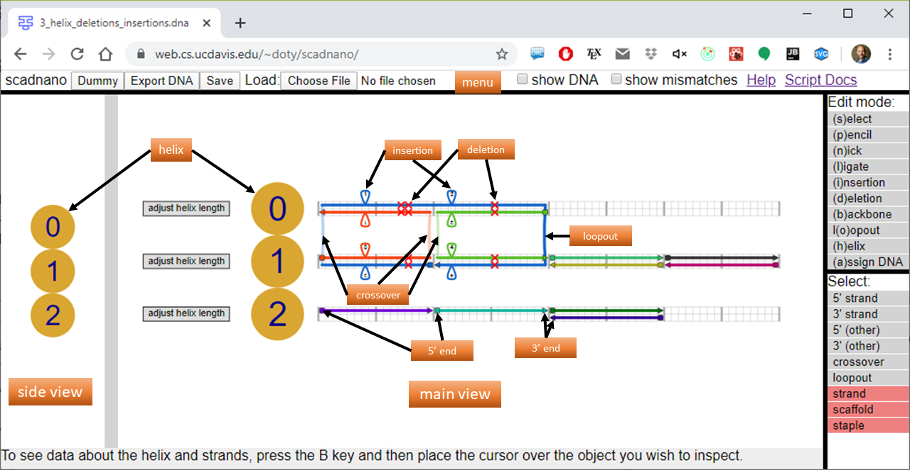

[scadnano](https://web.cs.ucdavis.edu/~doty/scadnano2) 
("scriptable-cadnano") 
is a program for designing synthetic DNA structures such as DNA origami. 
Its design is based on [cadnano](https://cadnano.org/), 
specifically [version 2](https://github.com/douglaslab/cadnano2), 
with two main differences: 

1) It runs entirely in the browser, with no installation required. Currently only [Chrome](https://www.google.com/chrome/) is supported, with support for [Firefox](https://www.mozilla.org/en-US/firefox/), [Edge](https://www.microsoft.com/en-us/windows/microsoft-edge), and [Safari](https://www.apple.com/safari/) planned in the future.

2) scadnano designs, while they can be edited manually in scadnano, can also be created and edited by a Python scripting library ([download](https://github.com/UC-Davis-molecular-computing/scadnano-python-package)/[documentation](./docs/)), to help automate tedious tasks.

A secondary goal is that the file format should be easily readable, to help when debugging scripts.

This document does not assume any familiarity with cadnano, 
although some parts explain slight differences between cadnano and scadnano for the benefit of those who have used cadnano.

Please file bug reports and make feature requests at the 
[GitHub repository](https://github.com/UC-Davis-molecular-computing/scadnano/issues).


## Terms

The main parts of the program are the *side view* on the left, and the *main view* in the center.
The side view shows DNA helices "head on", with the interpretation that as you move left-to-right in the main view, this is like moving "into the screen" in the side view.



The screenshot above shows many of the terms used in scadnano. To see how it is represented as a .dna file (which is itself something called JSON format): here is part of the file representing the above design:

```json
{
  "version": "0.0.1",
  "helices": [
    {"max_offset": 64, "grid_position": [0, 0]},
    {"grid_position": [0, 1]},
    {"max_offset": 64, "grid_position": [0, 2]}
  ],
  "strands": [
    {
      "color": "#0066cc",
      "dna_sequence": "AACTAACTAACTAACTAACTAACTAACTAACTAACTAACTAACTAACTAACTAACTAACTAACTAACTAACT",
      "substrands": [
        {"helix": 1, "forward": false, "start": 0, "end": 16, "deletions": [12], "insertions": [[6, 3]]},
        {"helix": 0, "forward": true, "start": 0, "end": 32, "deletions": [11, 12, 24], "insertions": [[6, 1], [18, 2]]},
        {"loopout": 3},
        {"helix": 1, "forward": false, "start": 16, "end": 32, "deletions": [24], "insertions": [[18, 4]]}
      ],
      "is_scaffold": true
    },
    {
      "color": "#f74308",
      "dna_sequence": "TTAGTTAGTTAGTTAGTTTAGTTAGTTAGTTAG",
      "substrands": [
        {"helix": 1, "forward": true, "start": 0, "end": 16, "deletions": [12], "insertions": [[6, 3]]},
        {"helix": 0, "forward": false, "start": 0, "end": 16, "deletions": [11, 12], "insertions": [[6, 1]]}
      ]
    },
    {
      "color": "#57bb00",
      "dna_sequence": "TTAGTTAGTTAGTTAGTAGTTAGTTAGTTAGTTAGT",
      "substrands": [
        {"helix": 0, "forward": false, "start": 16, "end": 32, "deletions": [24], "insertions": [[18, 2]]},
        {"helix": 1, "forward": true, "start": 16, "end": 32, "deletions": [24], "insertions": [[18, 4]]}
      ]
    },
...
```


TODO: explain data model: 5'/3' ends, strands, substrands, forward, offsets, crossovers, loopouts, helix rotations and anchors, etc.

## Navigation and control

**Navigation:** The side view and main view can both be navigated by using the mouse wheel/two-finger scroll gesture to zoom in and out, and clicking and dragging the background to pan. It is currently unsupported to [navigate entirely by keyboard](https://github.com/UC-Davis-molecular-computing/scadnano/issues/42) or to [navigate only by clicking](https://github.com/UC-Davis-molecular-computing/scadnano/issues/91).

**Undo/redo:**
Pressing Ctrl+Z will undo the last action that changed the design.
Pressing Shift+Ctrl+Z will redo it.

## Menu

The menu layout is currently hacky and will [change to something more elegant in the future](https://github.com/UC-Davis-molecular-computing/scadnano/issues/63).

* **Export DNA:**
Exports a file containing DNA sequences. A few defaults are available, but it is not very configurable. For more advanced control, the Python scripting package can be used to customize how DNA sequences are exported.

* **Save:**
Saves the current design in a .dna file. This is the same format output by (and readable by) the Python scripting package.

* **Load:**
Loads a .dna file. Note that due to browser security restrictions on accessing the local file system it is not possible for a changed design to be automatically loaded. This precludes the possibility of repeatedly re-running a local Python script and seeing the changed design immediately re-loaded in the browser; the Load button must be clicked and a local file selected whenever you wish to re-load the file.

* **show DNA:**
Shows any DNA sequences that have been assigned to the strands. For large designs (e.g., DNA origami using a > 7000-base scaffold), it can take a long time to render the DNA and slow down panning and zooming. Thus, it is recommended to uncheck this option most of the time unless actually inspecting the DNA sequences. Hopefully implementing [this feature request](https://github.com/UC-Davis-molecular-computing/scadnano/issues/30) will reduce the rendering time.

* **show mismatches:**
Shows DNA base pair mismatches. When assigning DNA sequences, the default is to assign a specified DNA sequence to one strand and to automatically assign the complement to any strands bound to it, which would result in no mismatches. However, using the Python scripting library (and this will be supported in the future in the web interface) it is possible to manually assign DNA sequences independently to strands without automatically assigning the complement to bound strands. This allows intentional mismatches to be placed in the design.

## Edit modes

There are different edit modes available, shown on the right side of the screen. Currently most of them are mutually exclusive, so selecting one will unselect the others. However, a few can be on simultaneously. Each edit mode has a keyboard shortcut that can be used to toggle it, shown in parentheses in the application's display.

* **(s)elect:**
This is similar to the Select edit mode in cadnano. It allows one to select one or more items and delete, move, or copy/paste them. Which are allowed to be selected depends on the "Select Mode", shown below the Edit modes. Some of these are mutually exclusive as well.

A single item can be selected by clicking. Multiple items can be selected by pressing Shift (to add to the selection) or Ctrl (to toggle whether an item is selected) and clicking multiple items. Also, if Shift or Ctrl is pressed while in select mode, one can use the mouse/touchpad to click+drag to select multiple items by drawing a box. 

Unlike other drawing programs, clicking on the background will not unselect the objects. To unselect all selected objects, press the Esc key.

  - **5' end (strand), 3' end (strand):**
  These allow one to select the 5' end (square) or 3' end (triangle) of a whole strand. 

  - **5' end (other), 3' end (other):**
  Each strand is composed of one or more *bound substrands*, defined to be a portion of a strand that exists on a single helix. A 5'/3' end of a bound substrand that is not the 5'/3' end of the whole strand is one of these. They are not normally visible, but when these select modes are enabled, they become visible on mouseover and can be selected and dragged. An important note is that bound substrands cannot be selected, but anything one would want to do with them can be done via their ends. Deleting a 5'/3' end of a bound substrand deletes the whole bound substrand. To move the whole bound substrand, simply select both of its ends and move them.

  - **crossover, loopout:**
  Two consecutive bound substrands on a strand can be joined by either a *crossover*, which consists of no DNA bases, or a *loopout*, which is a single-stranded portion of the strand with one or more DNA bases.[^1] 

  - **strand:**
  The whole strand can be selected.

  - **scaffold/staple:**
  In the case of a DNA origami design---one in which at least one strand is marked as a *scaffold*---all non-scaffold strands are called *staples*. This option allows one to select only scaffold strands/strand parts, only staples, or both.

    It is also possible to select helices in the side view. As currently implemented, the delete key does not delete them. Instead, they can be deleted by picking the "helix" edit mode and clicking on them.

  
* **(p)encil:**
This is similar to the Pencil edit mode in cadnano. It allows one to add new Strands. (Currently it is [unsupported](https://github.com/UC-Davis-molecular-computing/scadnano/issues/98) to change its length while added, so unfortunately you must add a strand of length 2 and then enable select mode to lengthen it.) It also allows one to merge two strands into one with a crossover. This is done by clicking on a 5'/3' end of one strand and then clicking on another. (In between a line will be drawn showing the "potential" crossover being added; to delete this and reset, press the Esc key.) To undo these operations select the crossover/strand that was just created and press the Delete key. (Note that deleting a bound substrand that is the only one on a strand will delete the whole strand.)

* **(n)ick / (l)igate:**
Technically these operations are unnecessary, but they give a fast way to create large designs. In nick mode, clicking on a bound substrand will split it into two at that position. Ligate mode does the reverse operation: if two bound substrands point in the same direction and have abutting 5'/3' ends, then clicking on either will join them into a single strand. A common way to create a large design quickly is to use pencil mode to create exactly two strands on each helix at the same horizontal offsets, one pointing forward (i.e,. its 5' end is on the left and its 3' end is on the right) and the other pointing in reverse. Then use select mode to drag them to be longer. Then use nick mode to add nicks and pencil mode to add crossovers.

* **(i)nsertion / (d)eletion:**
These have the same meaning as in cadnano. They are a visual trick used to allow  bound substrands to appear to be one length in the main view of scadnano, while actually having a different length. Normally, each offset (small white square outlined in gray on a helix) represents a single base. Clicking on a bound substrand in insertion/deletion mode adds an insertion/deletion at that offset. Clicking an existing insertion/deletion removes it. (Note that this requires clicking in the small square where the bound substrand is drawn; clicking on an insertion outside of that position allows one to change its length.) If a deletion appears at that position, then it does not correspond to any DNA base. If an insertion appears at that position, it has a *length*, which is a positive integer, and the number of bases represented by that position is actually *length*+1. In other words *length* is the number of *extra* bases at that position in addition to the one that was already there (so insertions always represent 2 or more bases). 

  Currently, if one offset on a helix has two bound substrands (going in opposite directions), then either both have an insertion/deletion at that offset, or neither does. The Python scripting library lets one specify insertions/deletions on one bound substrand but not the other, but this is currently [unsupported](https://github.com/UC-Davis-molecular-computing/scadnano/issues/90) in the web interface.

* **(b)ackbone:**
This shows information in the side view about the rotation of the helix when the pointer is over an offset of that helix in the main view, or of two helices when the pointer is over a crossover joining those two helices. Each helix has a notion of a rotation angle where the phosphate backbone of each of its two bound substrands are pointing. This is not intended to be a predictive model based on molecular kinetics, nor is it even intended to be meaningful over the entirety of a helix. Rather, it is useful to set the rotation at one offset on a helix and then inspect what scadnano claims the rotation will be at nearby offsets, in order to help pick appropriate crossover positions. 

  If a crossover is clicked while backbone mode is enabled, then the backbone rotation angles of the two helices connected by the crossover will be adjusted to point them at each other at their respective offsets. The Python scripting library can be used to set these more generally, but it is currently [unsupported](https://github.com/UC-Davis-molecular-computing/scadnano/issues/99) to set them arbitrarily in the web interface. It is also the case that some simple information about strands and substrands under the pointer is shown in the footer when backbone mode is enable, but this will [change](https://github.com/UC-Davis-molecular-computing/scadnano/issues/13) in the future.

* **l(o)opout:**
Clicking on a crossover or loopout lets one toggle between a crossover or loopout or change the length of a loopout. Setting length to a positive integer converts to a loopout and setting a length of 0 converts a loopout to a crossover.

* **(h)elix:**
Clicking on an existing helix will delete it. Clicking on an empty space will add a helix. The grid type (square, hexagonal, honeycomb, none) determines where new helices are allowed to be placed.

* **(a)ssign DNA:**
Clicking on a strand allows one to assign a DNA sequence to a strand. Any strands bound to the assigned strand will have their sequences assigned to be the complement of the relevant region. It is currently [unsupported](https://github.com/UC-Davis-molecular-computing/scadnano/issues/75) to assign a DNA sequence without assigning the complements to bound strands in this way.


## Exporting SVG

Exporting the design to SVG is [currently not directly supported](https://github.com/UC-Davis-molecular-computing/scadnano/issues/8). However, by installing the Chrome extension
[Export SVG with Style](https://chrome.google.com/webstore/detail/export-svg-with-style/dkjdcaddoplepioppogpckelchefhddi),
you can export it yourself:

Add the extension, then restart scadnano (press F5 button to refresh the page), and after loading the design you want to export to SVG, click the Export SVG Button.
It will report that there are two SVG elements on the page.
These are the side view and main view, respectively, and the extension will save both of them.


[^1]: Technically bound substrands do not have to be bound to another strand, but the idea is that generally in a finished design, most of the bound substrands will actually be bound to another. However, currently it is [unsupported](https://github.com/UC-Davis-molecular-computing/scadnano/issues/34) for a strand to begin or end with a loopout, so single-stranded bound substrands are currently necessary to support single-stranded extensions on the end of a strand.
