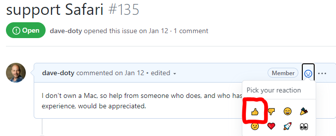
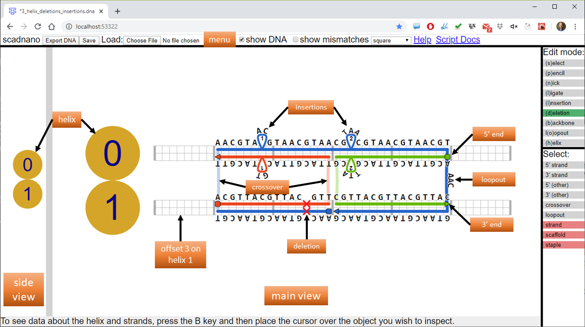
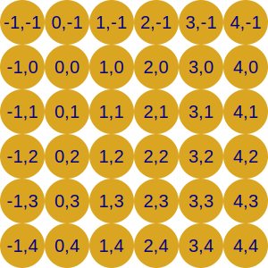
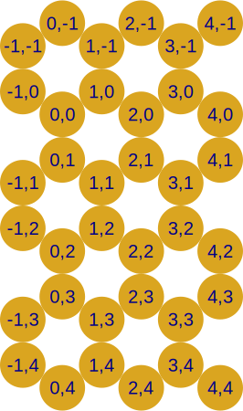
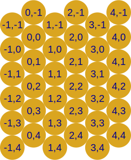
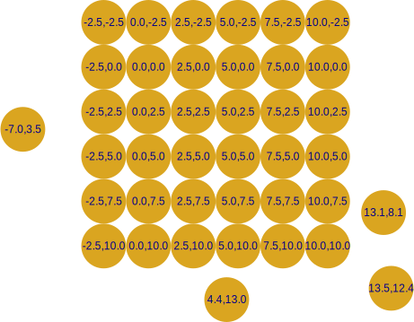
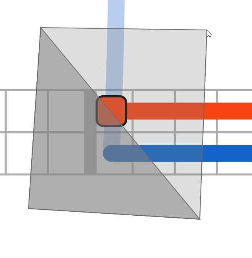
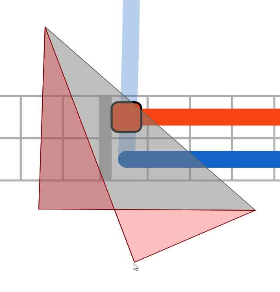

# scadnano

[scadnano](http://scadnano.org) 
("scriptable-cadnano", [source code repository here](https://github.com/UC-Davis-molecular-computing/scadnano)) 
is a program for designing synthetic DNA structures such as DNA origami. 

If you find scadnano useful in a scientific project, please cite its associated paper:

> <ins>scadnano: A browser-based, scriptable tool for designing DNA nanostructures</ins>.  
  David Doty, Benjamin L Lee, and Tristan Stérin.  
  DNA 2020: *Proceedings of the 26th International Conference on DNA Computing and Molecular Programming*  
  [ [paper](https://doi.org/10.4230/LIPIcs.DNA.2020.9) | [BibTeX](https://web.cs.ucdavis.edu/~doty/papers/scadnano.bib) ]

## Table of contents

* [Overview](#overview)
* [Reporting issues](#reporting-issues)
* [Tutorial](#tutorial)
* [**WARNING: Save your work**](#warning-save-your-work)
* [Stable and development versions](#stable-and-development-versions)
* [Terminology](#terminology)
* [Grid types](#grid-types)
* [Relation of grid_position and position to side and main view display](#relation-of-grid_position-and-position-to-side-and-main-view-display)
* [Navigation and control](#navigation-and-control)
* [Menu](#menu)
* [Side view menu](#side-view-menu)
* [Edit modes](#edit-modes)
* [Assigning DNA](#assigning-dna)
* [cadnano file format versus scadnano](#cadnano-file-format-versus-scadnano)
* [How to design structures manually using scadnano](#how-to-design-structures-manually-using-scadnano)
* [Performance tips](#performance-tips)
* [Contributing](#contributing)

## Overview

The design of scadnano is based heavily on [cadnano](https://cadnano.org/), 
specifically [version 2](https://github.com/douglaslab/cadnano2), 
with three main differences: 

1) scadnano runs entirely in the browser, with no installation required. 
Currently only 
[Chrome](https://www.google.com/chrome/) 
and 
[Firefox](https://www.mozilla.org/en-US/firefox/) 
are supported, with support for 
[Safari](https://www.apple.com/safari/) 
and 
[Edge](https://www.microsoft.com/en-us/windows/microsoft-edge) 
planned in the future.

2) scadnano designs, while they can be edited manually in scadnano, can also be created and edited by a well-documented Python scripting library 
([help](https://github.com/UC-Davis-molecular-computing/scadnano-python-package#readme) / 
[API](https://scadnano-python-package.readthedocs.io)), to help automate tedious tasks.

3) The file format is easily human-readable (see [example below](#terminology)), to help when debugging scripts or interfacing with other software.

This document explains how to use the web interface for viewing and manually editing designs.
The documentation for the Python scripting package is 
[here](https://scadnano-python-package.readthedocs.io).
This document does not assume any familiarity with cadnano, 
although some parts explain slight differences between cadnano and scadnano for the benefit of those who have used cadnano.

Please file bug reports and make feature requests as GitHub repository issues in the repositories for the
[web interface](https://github.com/UC-Davis-molecular-computing/scadnano/issues)
or the
[Python scripting library](https://github.com/UC-Davis-molecular-computing/scadnano-python-package/issues).

Early versions of this project didn't have well-defined versions. However, we will try to announce breaking changes (and possibly new features) under the [GitHub releases page](https://github.com/UC-Davis-molecular-computing/scadnano/releases). The version numbers in this web interface repo and the [Python library repo](https://github.com/UC-Davis-molecular-computing/scadnano-python-package/releases) won't always advance at the same time.

Following [semantic versioning](https://semver.org/), version numbers are major.minor.patch, i.e., version 0.9.2 has minor version number 9. Prior to version 1.0.0, when a breaking change is made, this will increment the minor version (for example, going from 0.9.4 to 0.10.0). After version 1.0.0, breaking changes will increment the major version.


## Reporting issues

Please report issues in the web interface at the [scadnano web interface GitHub repository](https://github.com/UC-Davis-molecular-computing/scadnano/issues), and report issues in the Python scripting library at the [scadnano Python package GitHub repository](https://github.com/UC-Davis-molecular-computing/scadnano-python-package/issues).

If you find an existing issue that you would like to see handled, please "vote" for it with the GitHub "thumbs up" on the top comment describing the issue:




## Tutorial

A [tutorial](https://github.com/UC-Davis-molecular-computing/scadnano/blob/master/tutorial/tutorial.md) shows how to create a "standard" 24-helix DNA origami rectangle using the scadnano web interface.


## **WARNING: Save your work**

It is strongly recommended that you frequently save your work by pressing the "Save" button to save your design to a `.sc` file on your computer.

Despite being run in a browser, currently this application is not really a "web app". Nothing is stored on a server; everything is running and being stored in your browser locally.
In particular, your design is not automatically saved in an easily recoverable way. *For convenience only*, the application uses something called [localStorage](https://developer.mozilla.org/en-US/docs/Web/API/Window/localStorage) to store your most recent design in the browser. Thus, if you close your browser and re-start the application later, you should see the design you were working on before. There are some options to customize the schedule of this in the file menu.

**However, relying on your browser's localStorage is not a safe or recommended method of saving your work.**
The storage format may change, or your browser may remove the contents of localStorage, and then your work would be lost.
You should press the "Save" button (or Ctrl+S keyboard shortcut) to save your design to your local file system.
Unfortunately, due to 
[browser security restrictions on accessing the local file system](https://gbksoft.com/blog/how-does-web-apps-work-with-local-files-through-the-browser/),
it is not possible to save your file automatically without further interaction;
after pressing "Save", you will always be prompted to specify a filename to which to save.

Chrome automatically appends (1), (2), ... to the filename if it already exists in the directory, 
so repeatedly saving the file will change its name every time. 
To disable this so that it uses the same filename every time you save, you can install the extension 
[Downloads Overwrite Already Existing Files](https://chrome.google.com/webstore/detail/downloads-overwrite-alrea/lddjgfpjnifpeondafidennlcfagekbp).

**Security settings preventing saving:** Some users have reported that in Chrome, they will be unable to save the file, which we have tracked as an [issue](https://github.com/UC-Davis-molecular-computing/scadnano/issues/402). However, it's not straightforward to reproduce that error. If you have trouble with this, try setting your Chrome "Safe Browsing" settings from "Enhanced protection" to "Standard protection". This is in Chrome Settings (listed under ⋮ symbol in the top right), under "Security". (See the [issue](https://github.com/UC-Davis-molecular-computing/scadnano/issues/402) for a screenshot.)


## Stable and development versions

- stable: https://scadnano.org
- dev: https://scadnano.org/dev

The scadnano stable version matches what is on the [master branch of the web interface code repository](https://github.com/UC-Davis-molecular-computing/scadnano).
The scadnano dev version matches what is on the [dev branch of the web interface code repository](https://github.com/UC-Davis-molecular-computing/scadnano/tree/dev).


Releases of the stable version are explained on the [releases page](https://github.com/UC-Davis-molecular-computing/scadnano/releases).
When [issues](https://github.com/UC-Davis-molecular-computing/scadnano/issues) are handled in a release, they are closed at the time the changes make their way to the master branch.
If an issue is handled in the dev branch, the issue remains open, but you will see a comment that looks something like this: 
"*dave-doty added a commit that referenced this issue 17 hours ago @dave-doty make width of File menu just enough to fit all entries on one line; fixes #339*". These comments can help you decide if you want to use the latest version of scadnano (https://scadnano.org/dev), which has fixed an issue, before it makes its way to the stable version (https://scadnano.org).


## Terminology

The main parts of the program are the *side view* on the left, and the *main view* in the center. 
The side view shows DNA helices "head on", with the interpretation that as you move to the right in the main view, this is like moving "into the screen" in the side view.
The side view assumes that all helices are parallel.
One can use different *groups* to specify groups of helices, such that all helices within a group are parallel, but different groups have different relative angles.
The side view shows only one group at a time (but the default is to have a single group).

Annotated screenshot of scadnano web interface:



The screenshot is annotated with labels showing many of the terms used in scadnano's data model. 
It is instructive to see how that example design is represented as a `.sc` file 
(which is itself something called [JSON format](https://en.wikipedia.org/wiki/JSON)):

```json
{
  "grid": "square",
  "helices": [
    {"max_offset": 48, "grid_position": [0, 0]},
    {"max_offset": 48, "grid_position": [0, 1]}
  ],
  "modifications_in_design": {
    "/5Biosg/": {
      "display_text": "B",
      "idt_text": "/5Biosg/",
      "location": "5'"
    }
  },
  "strands": [
    {
      "color": "#0066cc",
      "sequence": "AACGTAACGTAACGTAACGTAACGTAACGTAACGTAACGTAACGTAACGTAACGTAACGTAACGTAACG",
      "domains": [
        {"helix": 1, "forward": false, "start": 8, "end": 24, "deletions": [20]},
        {"helix": 0, "forward": true, "start": 8, "end": 40, "insertions": [[14, 1], [26, 2]]},
        {"loopout": 3},
        {"helix": 1, "forward": false, "start": 24, "end": 40}
      ],
      "is_scaffold": true
    },
    {
      "color": "#f74308",
      "sequence": "ACGTTACGTTACGTTTTACGTTACGTTACGTT",
      "domains": [
        {"helix": 1, "forward": true, "start": 8, "end": 24, "deletions": [20]},
        {"helix": 0, "forward": false, "start": 8, "end": 24, "insertions": [[14, 1]]}
      ]
    },
    {
      "color": "#57bb00",
      "sequence": "ACGTTACGTTACGTTACGCGTTACGTTACGTTAC",
      "domains": [
        {"helix": 0, "forward": false, "start": 24, "end": 40, "insertions": [[26, 2]]},
        {"helix": 1, "forward": true, "start": 24, "end": 40}
      ],
      "5prime_modification": "/5Biosg/"
    }
  ]
}
```

The [scripting library README](https://github.com/UC-Davis-molecular-computing/scadnano-python-package#example) shows Python code that produces this design.


Although it is not necessary to deal directly with the above JSON data, it is worthwhile to understand the data model it represents. 
This model is manipulated directly in the Python scripting library, and indirectly through the web interface.
This section explains the meaning of the terms, although some more detail about them is given in subsequent sections explaining how the interface allows them to be edited.

A design consists of a list of *helices* and a list of *strands*. 
The order of the helices matters; if there are *h* helices, the helices are numbered 0 through *h*-1.
This can be overridden by specifying a field called `idx` in each helix, but the default is to number them consecutively in order.
(The strands also have an order, which generally doesn't matter, but it influences, for instance, which are drawn on top, so a strand later in the list will have its crossovers drawn over the top of earlier strands.)
Each helix defines a set of integer *offsets* with a minimum and maximum; in the example above, the minimum and maximum for each helix are 0 and 48, respectively, so 48 total offsets are shown.
Each offset is a position along the length of a helix where a DNA base of a strand can go.

One can also specify a *grid* type, a.k.a., *lattice*, one of the following types: square, hex, honeycomb, or none.
Technically this is not associated to the whole design, but to a *group*, described below.
However, there is a default group, and putting a grid as a top-level JSON field means it will be assigned to the default group.
Helices in a grid have a two-integer *grid position* depicted in the side view.
See the [Python scripting documentation](https://scadnano-python-package.readthedocs.io/#scadnano.scadnano.Helix.grid_position) for more detail about the meaning of these positions.
Helices without a grid have a *position*, a 3D real vector describing their *x*, *y*, *z* coordinates in units of nanometers.

A Helix may also define angles *pitch*, *roll*, and *yaw* in units of degrees, but this feature is currently 
[not well-supported](https://github.com/UC-Davis-molecular-computing/scadnano/issues/39). 
Helix.yaw will likely never be supported visually in the main or side views, 
but it is retained as a field for compatibility with other software for 3D visualization.
Helix.roll is currently supported, and the interpretation is that roll 0 means the phosphate backbone of the strand that is forward=true on the helix is pointing straight *up* in the side and main views.
Rotation is clockwise, at a rate of 10.5 base pairs per 360 degrees.

Helix.pitch, which refers to rotation of the helix in the plane of the main view, is currently ignored.
However, it is possible to rotate helices in the main view, using *groups*, described below.

The position of helices in the main view depends on the grid position if a grid is used, and on the position otherwise. 
(Each grid position is interpreted as a position from a constrained set of possible positions.)
They are listed from top to bottom in the order they appear in the sequence 
(unless the property *helices_view_order* is specified in the design to display them in a different order, 
though currently this can only be done in the scripting library).

Each strand is defined primarily by an ordered list of *domains*.
Each domain is either a single-stranded *loopout* not associated to any helix, 
or it is a *bound domain*: a region of the strand that is contiguous on a single helix.
The phrase is a bit misleading, since a bound domain is not necessarily bound to another strand, 
but the intention is for most of them to be bound, 
and for single-stranded regions usually to be represented by loopouts.

Each bound domain is specified by four mandatory properties:
*helix*, direction (*forward* or reverse), *start* offset, and a larger *end* offset.
As with common string/list indexing in programming languages, start is inclusive but end is exclusive.
So for example, a bound domain with *end*=8 is adjacent to one with *start*=8.
In the main view, *forward* bound domains are depicted on the top half of the helix, and *reverse* are on the bottom half.
If a bound domain is forward, then *start* is the offset of its 5' end, and *end*-1 is the offset of its 3' end, 
otherwise these roles are reversed.
There is implicitly a crossover between adjacent bound domains in a strand.
Although the visual depiction of a loopout is similar to a crossover, loopouts are explicitly specified as a (non-bound) domain in between two bound domains.
Currently, two loopouts cannot be consecutive (and this will remain a requirement),
and a loopout cannot be the first or last domain of a strand.
This constraint may be [relaxed in the future](https://github.com/UC-Davis-molecular-computing/scadnano/issues/34). 
For now, if you need to put a single-stranded overhang at the end of a strand, a good solution is to add a 5' or 3' modification whose idt_text (see description of modifications below) is the DNA sequence you want to assign.

Bound domains may have optional fields, notably *deletions* (called *skips* in cadnano) and *insertions* (called *loops* in cadnano), explained below.

Each strand also has a *color* and a Boolean field *is_scaffold*.
DNA origami designs have at least one strand that is a scaffold (but can have more than one), and a non-DNA-origami design is simply one in which every strand has *is_scaffold* = false.
Unlike cadnano, a scaffold strand can have either direction on any helix.
When there is at least one scaffold, all non-scaffold strands are called *staples*.
The general idea behind DNA origami is that every staple strand binds only to a scaffold, never to another staple.
Neither does any scaffold bind to another scaffold or itself.
However, neither of these conventions is enforced by scadnano, and there are legitimate reasons to want non-scaffold strands to bind to each other (e.g., for DNA [walkers](https://www.doi.org/10.1038/nature09026) or [circuits](https://doi.org/10.1038/nnano.2017.127) on the surface of an origami).
See the [original paper](https://doi.org/10.1038/nature04586) for more detailed instructions for designing DNA origami.

A strand can have an optional DNA sequence.
Of course, since the whole point of this software is to help design DNA structures, at some point a DNA sequence should be assigned to some of the strands.
However, it is often best to mostly finalize the design before assigning a DNA sequence, which is why the field is optional.
Many of the operations attempt to keep things consistent when modifying a design where some strands already have DNA sequences assigned, but in some cases it's not clear what to do. 
(e.g., what happens when a length-5 strand with sequence AACGT is extended to have a larger length? what DNA bases are assigned to the new offsets?)

Each helix belongs to a *group*.
If not specified, all helices are in the group named `"default_group"`.
Most DNA designs, even those that have not all helices parallel, will typically have several groups of helices, where all helices in a group *are* parallel.
The way that scadnano supports such designs is as follows.
*groups* is a top-level field in the Design JSON, mapping a group name (a string) to a map describing the group.
Each group has fields `grid`, `position` (itself a map with `x`, `y`, `z` fields), `pitch`, `yaw`, `roll`, and `helices_view_order`.
If not specified, `"default_group"` is the name, with `grid="none"`, `helices_view_order` assumed to be the indices of helices in this group in increasing order, and all other values are numbers equal to 0.
Each helix is associated to a group via field `group` in the helix description, giving the name of the group.
All helices in a group are translated by the group's `position` and rotated in the main view by the group's `pitch` angle.
(Although one can specify `pitch` for an individual helix, this is for the sake of compatibility with other tools, but that field of the helix is ignored by the scadnano interface.)


## Grid types

Each is described by a 2D (*h*,*v*) coordinate system. In all cases, *h* increases moving right in the side view and *v* increases moving down. (i.e., so-called *screen coordinates*, as opposed to *Cartesian coordinates* where *v* increases moving up)

The grid types square, honeycomb, hex all have *integer* coordinates. Examples are shown below.

square grid:



honeycomb grid (this matches the coordinate system used by cadnano for the honeycomb grid):



hexagonal grid (note that although the honeycomb grid is a subset of the hex grid, they use a different coordinate system; e.g., note the differing relative positions of (1,1) and (2,1) in each). This is called the "odd-q" coordinate system here: https://www.redblobgames.com/grids/hexagons/:



In contrast, the "none" grid type uses *real* numbers (not integers). One can think of this as the most general coordinate system, where square, hex, and honeycomb are special cases restricting the allowed real-valued positions. Below shows an example of converting the square grid helices above to the none grid, and then adding four more helices whose positions are not possible in any of the grid-based coordinate systems.

none grid:




## Relation of grid_position and position to side and main view display
The main view and side views are 2D representations of a 3D object.
The views display helices in the following way.
First, each helix in a group is translated by its group's `position.x` and `position.y` values, and rotated clockwise by the group's `pitch` angle.
The description below is relative to this translation and rotation.

Each helix has a 3D *(x,y,z)* position (grid_position is simply a special type of position, and a position is calculated from the grid_position if a grid is used.)
The *z* and *y* coordinates are shown in the side view, with *z* increasing to the right and *y* increasing to the bottom (so-called "screen coordinates", which invert *y* compared to Cartesian coordinates).

In the main view, the horizontal direction is the *x* coordinate.
The vertical direction, however, is not exactly the *y* coordinate, since this would simply pile helices on top of each other if their *y* coordinates were close or equal (which is common in a 3D design).
Instead, the helices are displayed in order from top to bottom (by their index, or if specified, by the value *helices_view_order* in the DNA design, which can specify an alternate permutation).
The vertical distance between adjacent helices is supposed to approximate the Euclidean *z-y* distance between the helices (i.e., the side view distance; the *x* distance is ignored in this calculation).
If the helices are co-planar (such as a flat origami in the square grid, where all helices have the same *z* coordinate, or they all have the same *y* coordinate),
then this will display the entire design to scale, with each helix appearing the correct relative distance from all others.
Otherwise, the distances between pairs of helices with *adjacent indices* will be to scale. 

[TODO: make some figures showing examples]


## Navigation and control

**Navigation:** The side view and main view can both be navigated by using the mouse wheel/two-finger scroll gesture to zoom in and out, and clicking and dragging the background to pan. It is currently unsupported to [navigate entirely by keyboard](https://github.com/UC-Davis-molecular-computing/scadnano/issues/42) or to [navigate only by clicking](https://github.com/UC-Davis-molecular-computing/scadnano/issues/91).

**Undo/redo:**
Pressing Ctrl+Z will undo the last action that changed the design.
Pressing Shift+Ctrl+Z will redo it.

**Right-click:**
Some items can be right-clicked (or Ctrl-clicked on Mac) to bring up a context menu. **Note for cadnano users:** Some features of cadnano are available in this way, for example assigning a DNA sequence or a color to a strand. For such items the browser's normal right-click is disabled. To see the browser's normal right-click menu on such items, press Shift + right-click.

Right-clicking on a crossover or loopout lets one toggle between a crossover or loopout or change the length of a loopout. 
Setting length to a positive integer converts to a loopout and setting a length of 0 converts a loopout to a crossover.


## Menu

In both the side menu and the main menu, hovering the cursor over a most menu items brings up a tooltip explaining the menu item in more detail.

This refers to the menu at the top of the whole app. At the top of the side view, there is a *side view menu*, described below.

* File
  * **Load example:** Some pre-made example designs can be loaded.

  * **Open:**
  Loads a `.sc` file from your local computer. (The extension `.json` is also recognized.) Note that due to browser security restrictions on accessing the local file system, it is not possible for a changed design to be automatically loaded. This precludes the possibility of repeatedly re-running a local Python script and seeing the changed design immediately re-loaded in the browser; the Load button must be clicked and a local file selected whenever you wish to re-load the file.

    Another way to load a `.sc` file is to click and drag it onto the scadnano web interface from your local file system.

  * **Save:**
  Saves the current design in a `.sc` file on your local computer. This is the same format output by (and readable by) the [Python scripting package](https://github.com/UC-Davis-molecular-computing/scadnano-python-package).

  * **Import/Export cadnano v2:**
  Files in the format recognized by [cadnano v2](https://github.com/douglaslab/cadnano2) can be imported and exported. Since cadnano's file format is less expressive, certain features may be lost in an export. See below for details.

  * **Save design in localStorage on every edit:**
  On every edit, save current design in localStorage (in your web browser). Disabling this minimizes the time needed to render large designs.

  * **Save design in localStorage before exiting:**
  Before exiting, save current design in localStorage (in your web browser). For large designs, this is faster than saving on every edit, but if the browser crashes, all changes made will be lost, so it is not as safe as storing on every edit.

  * **Do not save design in localStorage:**
  Never saves the design in localStorage.

  * **Save design in localStorage periodically:**
  Periodically (number of seconds customizable), save current design in localStorage (in your web browser). 
  Also saves before exiting.
  This is safer than never saving, or saving only before exiting, but will not save edits that occurred between the last edit and a browser crash.


* Edit
  * **Copy/paste:**
    Strands can be copied and pasted. If they are pasted to the opposite direction (e.g., if you copy a strand that is forward on a helix and paste it to the reverse part of a helix),
    then the "polarity" of each strand is reversed: 5' and 3' ends swap.

  * **Undo/Redo:** 
    Undo or redo the last edit that was made to the design.

  * **Pasted strands keep original color:**
    If unchecked, then pasted strands will be given a new color as if they had been newly created. If checked, they keep the same color as the original.

  * **Inline insertions/deletions:**
    The "Inline I/D" button "inlines" insertions and deletions in the following way.
    Insertions and deletions are removed, and their domains have their lengths altered. 
    Also, major tick marks on the helices will be shifted to preserve their adjacency to bases already present. 
    For example, if there are major tick marks at 0, 8, 18, 24, and a deletion between 0 and 8, 
    then the domain is shorted by 1, and the tick marks become 0, 7, 15, 23, and the helix’s maximum offset is shrunk by 1.

    We assume that a major tick mark appears just to the LEFT of the offset it encodes, 
    e.g., with minimum offset set, a major tick mark at offset 0 is the leftmost tick mark that could appear.

  * **Set helix coordinates based on crossovers:**
    scadnano can help to visualize 3D structure of designs where all helices are parallel. This can only be used on a gridless design (i.e., the *none* grid). Select a group of crossovers, one per pair of helices that are displayed adjacently in the main view (i.e., they are adjacent in view order, meaning their indices are adjacent if `helices_view_order` is not specified), and then click this button. Those crossovers are used to calculate the angles between helices assuming that those crossovers are unstrained. The *x*,*y* coordinates of each helix other than the first will be set to match the expected angles between helices, and the *roll* value of each helix other than the first will be set to point the backbone angles of each helix at its neighbors at those crossovers.

    You can also select some helices first, and then only those helices will be adjusted. (This is useful if some adjacent helices in your design do not have crossovers between them.) 
    
    You can also choose not to select some crossovers. For any pair of adjacent helices where you do not select a crossover, the "leftmost" crossover is chosen. (Defined as the crossover whose offset on the *first* helix in the ordering is minimal.)

    The roll of the first helix in view order is used to compute positions and rolls of the remaining. Thus, if you would like the whole design to be at a certain rotation, first set the roll of the first helix, and then click this button.

  * **Set geometric parameters:**
    Set geometric parameters affecting how the design is displayed.
    
    * rise per base pair: This is the number of nanometers a single base pair occupies (i.e., width in main view)

    * helix radius: The radius of a helix in nanometers.

    * inter-helix gap: The distance between two adjacent helices. The value 2*helix_radius+inter_helix_gap is the distance between the centers of two adjacent helices.

    * bases per turn: The number of bases in a single full turn of DNA.

    * minor groove angle: The angle in degrees of the minor groove, when looking at the helix in the direction of its long axis.
  
* View

  * **show DNA sequences:**
    Shows any DNA sequences that have been assigned to the strands. 

  * **show DNA base mismatches:**
    Shows DNA base pair mismatches. When assigning DNA sequences, the default is to assign a specified DNA sequence to one strand and to automatically assign the complement to any strands bound to it, which would result in no mismatches. However, using either the web interface or the Python scripting library, it is possible to manually assign DNA sequences independently to strands without automatically assigning the complement to bound strands. This allows intentional mismatches to be placed in the design.

  * **show modifications:**
    Shows any modifications to the DNA (e.g., biotin, fluorophore attachments). Currently only a string representation of the modification is shown, but in the future support is [planned](https://github.com/UC-Davis-molecular-computing/scadnano/issues/226) for showing images.

    * **Display modification connector:** 
    This shows the modification slightly above or below the strand (depending whether the domain is forward or not) with a line connecting it to the strand. This makes it easier to see the underlying strand but distorts the actual relative positions of the modifications. If unchecked, the modification is drawn directly on the base/end it modifies, displaying their positions exactly where one would expect them to appear in the design.

    * **Modification font size:**
    The font size of the display text of the modification can be adjusted as needed.

  * **Display major tick offsets:**
  If checked, integer offsets are displayed just above the major tick marks. This can be on only the top helix, or on all helices.
  
  * **Display major tick widths:**
  If checked, integer distances between adjacent major tick marks are displayed just above the center point between them. Since major tick marks are often used to indicate interesting domains/sub-domains of DNA strands, this can be used to quickly see the length of those domains. (But major tick marks are not explicitly tied to the Domains on Strands defined in the DNADesign.) This can be on only the top helix, or on all helices.

  * **auto-fit on loading new design:**
    When a new design is loaded, scales the zoom window to fit the design. This is useful when loaded a brand new design, to ensure that the design is visible. If it is offset too much, it will not be visible, and it will be difficult to "find" by panning. However, when frequently re-loading a design, for example a design being updated by running a local Python script, it is preferable to uncheck this option, so that the same part of the design will remain visible after loading.


  * **display only selected helices:**
    This is a useful way to visualize only certain parts of a complex design, particularly 3D designs with many "long-range" crossovers. These are crossovers that (like all crossovers) actually represent just a single phosphate group joining two consecutive bases, but are visually depicted in the 2D main view as "stretching" between two helices that are displayed far from each other. When this option is selected, then only helices that are selected (using Ctrl/Shift+click, or Ctrl/Shift + drag), are displayed in the main view, and only crossovers between two displayed helices are shown.

  * **invert y- and x-axes:**
    In the main view, invert the y-axis, and in the side view, invert both the x-axis and the y-axis.
    If unchecked, then use "screen coordinates", where increasing y moves down.
    If checked, then use Cartesian coordinates where increasing y moves up.
    Also invert the x-axis to maintain chirality, so this has the net effect of rotating the side view by 180 degrees.

  * **Show main view Helix circles/idx:**
    Shows helix circles and idx's in main view. You may want to hide them for designs that have overlapping non-parallel helices.

  * **Show grid coordinates in side view:**
    Shows grid coordinates in the side view under the helix index.


* Export

  * **Export SVG:**
    Use the "Export SVG side" and "Export SVG main" buttons to export an SVG file suitable for making a figure of the DNA design.

    SVG viewers/editors (like browsers) are notoriously inconsistent in implementing the SVG standard, so we cannot guarantee that the exported SVG will render properly in all such programs. We have primarily tested the export functionality by viewing with [Inkscape](https://inkscape.org/), a popular, free, open-source SVG editor. The SVG files should also be viewable using the browsers supported by scadnano.

    If you [report a bug](https://github.com/UC-Davis-molecular-computing/scadnano/issues) with the SVG export feature, please first ensure that the exported SVG displays improperly in either Inkscape or in a supported browser.

  * **DNA sequences:**
    Exports a file containing DNA sequences. A few defaults are available, but it is not very configurable. For more advanced control, the Python scripting package can be used to customize how DNA sequences are exported.

* Help

  * This contains links to various web sites associated with scadnano, which contain its documentation.


## Side view menu

In both the side menu and the main menu, hovering the cursor over a most menu items brings up a tooltip explaining the menu item in more detail.

* **Group:**
  This displays the current groups. Although all helices are displayed at once in the main view, in the side view, only one group is displayed at a time. Using this menu one can switch which group is displayed. These options are also available:

  * **adjust current group:**
  Adjusts properties of the current group (e.g., grid or pitch angle)

  * **new group:**
  Creates a new group.

  * **remove current group:**
  Removes the current group.

* **Grid:**
  The grid type can be changed to any of:
  
  * square
  * honeycomb
  * hex
  * none
  
  When converting between them, existing helices are preserved. Converting between square, honeycomb, and hex preserves the integer grid coordinate, but because these each interpret those coordinates differently, the helices will move their absolute position. In contrast, when converting between the three grids and none, the absolute location is preserved as best in can be. Converting from a grid to none simply translates the integer grid coordinate to the real-valued position (in nanometers) it represents. Converting from none to a grid moves the helix to the closest grid location, so it may move some helices if they are not perfectly positioned on a grid coordinate.


## Edit modes

There are different edit modes available, shown on the right side of the screen. Currently most of them are mutually exclusive, so selecting one will unselect the others. However, a few can be on simultaneously. Each edit mode has a keyboard shortcut that can be used to toggle it, shown in parentheses in the application's display.

* **(s)elect:**
  This is similar to the Select edit mode in cadnano. It allows one to select one or more items and delete, move, or copy/paste them. Which are allowed to be selected depends on the "Select Mode", shown below the Edit modes. Some of these are mutually exclusive as well.

  A single item can be selected by clicking. Multiple items can be selected by pressing Shift (to add to the selection) or Ctrl (to toggle whether an item is selected) and clicking multiple items. Ctrl+A will select all selectable items in the design. If Shift or Ctrl is pressed while in select mode, one can use the mouse/touchpad to click+drag to select multiple items by drawing a rectangular box. See also "rope select" mode, described below, for a more flexible way to select many items by drawing an arbitrary polygon (useful for selecting many items lined up diagonally, for instance).

  Unlike other drawing programs, clicking on the background will not unselect the objects.
  (This is a deliberate design choice, since we have found it is frequently useful to be able to click for other purposes, e.g., panning the view, while keeping all items selected.) 
  To unselect all selected objects, press the Esc key.

  **Note:** On a Mac, the delete key has the meaning of backspace, which in most browsers will try to go to the previous page. To delete an item on a Mac, press fn+delete.

  The following are the types of objects that can be selected in the main view.

  - **strand:**
    The whole strand can be selected. Groups of strands can be copy/pasted or moved, but only if they are all in the same helix group. (Though they can be copied/moved *to* a different helix group.)

  - **domain:**
    A single bound domain can be selected. Groups of domains can be moved, but only if they are all in the same helix group. (Though they can be moved *to* a different helix group.)

  - **all ends:**
    Selects all of 5' strand, 3' strand, 5' domain, 3' domain; these are described below.

  - **5' strand, 3' strand:**
    These allow one to select the 5' end (square) or 3' end (triangle) of a whole strand. 
    
    If many 5'/3' ends are selected, then one can add a 5'/3' modification to all of them by right-clicking and selecting "add modification". This will add only to the type of modification picked. For example, if both 5' and 3' ends are selected, and a 5' modification is added, then only the 5' ends are modified.

  - **5' domain, 3' domain:**
    Each strand is composed of one or more *bound domains*, defined to be a portion of a strand that exists on a single helix. A 5'/3' end of a bound domain that is not the 5'/3' end of the whole strand is one of these. They are not normally visible, but when these select modes are enabled, they become visible on mouseover and can be selected and dragged. Deleting a 5'/3' end of a bound domain deletes the whole bound domain. Ends can be moved, but unlike strands and domains, they can only be moved back and forth along their current helix.

  - **crossover, loopout:**
    Two consecutive bound domains on a strand can be joined by either a *crossover*, which consists of no DNA bases, or a *loopout*, which is a single-stranded portion of the strand with one or more DNA bases. (Technically bound domains do not have to be bound to another strand, but the idea is that generally in a finished design, most of the bound domains will actually be bound to another.)

    If many crossovers/loopouts are selected, all the crossovers can be converted to loopouts (or vice versa) by right-clicking on one fo them and picking "convert to loopout" (or "change loopout length" if a loopout; changing to length 0 converts it to a crossover).

  - **deletion, insertion:**
    Deletions and insertions can be selected and deleted in batch by pressing the Delete key. Also, one can change the length of all selected insertions by right-clicking on one of them and selecting the option to change insertion length.

  - **modification:**
    If many modifications are selected, they can be deleted at once by pressing the Delete key (or right-clicking and selecting "remove modification"). Those of a similar type (5', 3', or internal) can be modified in batch by right-clicking on one of them and selecting "edit modification".

  - **scaffold/staple:**
    In the case of a DNA origami design---one in which at least one strand is marked as a *scaffold*---all non-scaffold strands are called *staples*. This option allows one to select only scaffold strands/strand parts, only staples, or both. The option is not shown in a non-origami design.

    It is also possible to select helices in the side view. As currently implemented, the delete key does not delete them. Instead, they can be deleted by picking the "helix" edit mode and clicking on them.

  Regardless of the current select mode, it is always possible to select helices in the side view. Pressing delete will delete those helices. You can also delete a helix by clicking on the helix in the side view while in pencil mode (see below).

* **(r)ope select:**
  This is similar to select mode, but it allows one to draw a general polygon (a "rope"), rather than just a rectangle. This is useful, for example, for selecting many objects along a diagonal, where a rectangle containing all of them would also contain many objects off the diagonal that are not intended to be selected.
  
  The interpretation of Shift and Ctrl are similar (Shift means add all items inside the polygon to the selected items; Ctrl means toggle them). First, press and hold either Shift or Ctrl. While holding down the Shift or Ctrl key, click several points to define a polygon. 

  

  Two polygons are shown: a darker *n*-gon defined by the *n* points that have been clicked so far (the triangle below), and an (*n*+1)-gon showing what the new polygon would be if another click happens. (In this example the (*n*+1)-gon is larger, but it can be smaller, for instance if the mouse cursor were between the triangle's hypotenuse and its lower-left vertex.) The polygon must be *non-self-intersecting*: no two edges of the polygon can cross each other. If the mouse cursor is at a point that would make the polygon self-intersecting, then it is drawn in red, and clicking will have no effect:

  

  Lifting up on the Shift or Ctrl key will select items within the *n*-gon (the darker polygon).

  You can also select individual objects by clicking them while in rope select mode. However, Shift/Ctrl+clicking multiple items is awkward in rope select mode, since it will start drawing a polygon. So it is suggested to use select mode to select many items by clicking individually on each of them while holding the Shift key.
  
* **(p)encil:**
  This is similar to the Pencil edit mode in cadnano. It allows one to add new Strands (with a single domain) by clicking and dragging. 
  
  It also allows one to merge two strands into one with a crossover. This is done by clicking on a 5'/3' end of one strand and then clicking on another. (In between a line will be drawn showing the "potential" crossover being added; to delete this and reset, press the Esc key.) To undo these operations select the crossover/strand that was just created and press the Delete key. (Note that deleting a bound domain that is the only one on a strand will delete the whole strand.)

  A faster alternative that works in most circumstances is this. In pencil mode, if two bound domains on adjacent helices have their 5'/3' ends at the *same horizontal offset*, by placing the cursor over where a crossover between them would appear, a potential crossover appears, which can be clicked to add a crossover.

  In pencil mode, clicking on an existing helix will delete it. Clicking on an empty space will add a helix. The grid type (square, hexagonal, honeycomb, none) determines where new helices are allowed to be placed.

* **(n)ick / (l)igate:**
  Technically these operations are unnecessary, but they are faster than creating/moving/deleting domains in some circumstances. In nick mode, clicking on a bound domain will split it into two at that position. Ligate mode does the reverse operation: if two bound domains point in the same direction and have abutting 5'/3' ends, then clicking on either will join them into a single strand. A common way to create a large design quickly is to use pencil mode to create exactly two strands on each helix at the same horizontal offsets, one pointing forward (i.e,. its 5' end is on the left and its 3' end is on the right) and the other pointing in reverse. Then use select mode to drag them to be longer. Then use nick mode to add nicks and pencil mode to add crossovers.

* **(i)nsertion / (d)eletion:**
  These have the same meaning as in cadnano, where they are called "loops" and "skips", respectively. 
  They are a visual trick used to allow bound domains to appear to be one length in the main view of scadnano, while actually having a different length. 
  Normally, each offset (small white square outlined in gray on a helix) represents a single base. 
  Clicking on a bound domain in insertion/deletion mode adds an insertion/deletion at that offset. 
  Clicking an existing insertion/deletion removes it. 
  (Note that this requires clicking in the small square where the bound domain is drawn; 
  clicking on an insertion outside of that square has no effect.) 
  If a deletion appears at that position, then it does not correspond to any DNA base. 
  If an insertion appears at that position, it has a *length*, which is a positive integer, 
  and the number of bases represented by that position is actually *length*+1. 
  In other words *length* is the number of *extra* bases at that position in addition to the one that was already there (so insertions always represent 2 or more bases). 

  If one offset on a helix has two bound domains (going in opposite directions), 
  then adding/removing an insertion/deletion at that offset adds/removes on both bound domains.
  If you want only one of the domains to have the insertion/deletion, then click while in insertion/deletion edit mode to add to both, switch to Select mode, select the unwanted one, and press the Delete key.

  A useful shortcut allows one to add many insertions/deletions to the same offset on all helices (in a helix group). 
  If the Ctrl key is pressed while clicking on a domain in Deletion/Insertion mode, then deletions/insertions will be added at *all* domains on all helices in the same helix group that overlap the same offset (unless that offset is the start or end of the domain, which is disallowed from having a deletion/insertion).
  This helps to implement, for example, twist correction in DNA origami (see https://doi.org/10.1038/nchem.1070 for a description), where vertical "columns" of deletions need to be added to every domain in every helix at a given offset.

  *Note for cadnano users:* From the user's perspective, cadnano associates each deletion/insertion to an "address", i.e., a helix and offset on that helix. For instance, it is possible to have a "deletion" where there is no DNA strand, and if DNA strand(s) are later placed there, they will have the deletion. By contrast, in scadnano, insertions and deletions are associated to a bound domain. If the domain (or the whole strand) moves, the insertions/deletions move along with it.

* **(b)ackbone:**
  This shows information in the side view about the roll of the helix when the pointer is over an offset of that helix in the main view, 
  or of two helices when the pointer is over a crossover joining those two helices. 
  (It doesn't actually enable any edits, but it *disables* other edits for technical reasons related detecting click events.)
  Each helix has a notion of a roll angle where the phosphate backbone of each of its two bound domains are pointing. 
  The purpose of this feature is to help place crossovers between helices at points where the backbone of the strand being connected by the crossover is minimally strained.
  Most interesting crossovers will be between two helices that are tangent to each other in the side view.
  Ideally, the roll of each helix is such that the backbones "point at each other".

  This is not intended to be a predictive model based on molecular kinetics, 
  nor is it even intended to be meaningful over the entirety of a helix. 
  Rather, it is useful to set the roll at one offset on a helix to be "perfect"
  (i.e., the backbones of the two helices at that offset point directly at each other)
  and then inspect what scadnano claims the roll will be at nearby offsets, in order to help pick appropriate crossover positions. 

  Each crossover has a right-click option "unstrain backbone here".
  If this is selected, then the backbone roll angles of the two helices connected by the crossover will be adjusted to point them at each other at their respective offsets. 
  The Python scripting library can be used to set these more generally, but it is currently [unsupported](https://github.com/UC-Davis-molecular-computing/scadnano/issues/99) to set them arbitrarily in the web interface. 
  It is also the case that some simple information about strands and domains under the pointer is shown in the footer when backbone mode is enable, but this will [change](https://github.com/UC-Davis-molecular-computing/scadnano/issues/13) in the future.


* **(m)ove group:**
  This mode allows one to translate the currently selected helix group in the main view by clicking and dragging (i.e., to change its `position.x` and `position.y` coordinates, which can also be set manually under the menu Group &rarr; adjust current group). When in this mode, press either the Ctrl (Cmd on Mac) or Shift key and then click+drag with the cursor. (Without pressing Ctrl or Shift, the normal panning of the view will occur, without changing the position of any helix group.)


## Assigning DNA
Right-clicking on a strand allows one to assign a DNA sequence to a strand (or remove it if assigned). 
By default any strands bound to the assigned strand will have their sequences assigned to be the complement of the relevant region. 
Disabling this allows one to create intentional mismatches.

It is possible to assign DNA to a strand that already has DNA assigned to it. It will replace the previous DNA sequence. 
However, be careful in automatically assigning DNA complements to strands bound to this one.
This is allowed, but only if the new sequence will not conflict with the old one, unless option "warn if assigning different sequence to bound strand" is disabled.
If doing such an assignment would result in trying to write over a DNA base on a bound strand with a different base than it already has, this is not allowed.
First, remove the DNA sequence from the strand and its bound strands, then assign a fresh DNA sequence.
You can also disable the warning "warn if assigning different sequence to bound strand", in which case the bound strands will be silently overwritten with the new complementary sequence.

One reason to keep the warning enabled, but still assign DNA to a strand bound to another with DNA already assigned, is that complementary DNA can be built partially in stages.
For example, if a strand *s1* is connected to two others *s2* and *s3*, then DNA can be assigned to *s2*, followed by *s3*.
Any bases on *s1* not bound to *s2* (for instance, those bound to *s3*), after *s2* has a sequence assigned to it, will receive the wildcard symbol `?` as their "DNA base".
Upon subsequently assigning a DNA sequence to *s3*, the complementary portions of *s1* (which have a `?`) will be overwritten with the appropriate DNA sequence, even if the warning is enabled.
Thus the warning only concerns a concrete DNA base, one of `A`, `C`, `G`, or `T`, if it already exists and is about to be overwritten with a different base.

[TODO: make a figure showing this]


## cadnano file format versus scadnano
Files in the format recognized by [cadnano v2](https://github.com/douglaslab/cadnano2) can be imported and exported from scadnano, in both the Python scripting library and the web interface. However, since the cadnano format is more limited, some scadnano features may be lost upon export.

TODO: discuss these.


## How to design structures manually using scadnano
A full DNA origami design using a standard 7249-base M13mp18 scaffold uses ~200 staples, which are tedious to create manually.
cadnano provides *autostaple* and *autobreak* utilities for quickly creating a large number of staple strands.
However, there are fewer than a dozen different *types* of staples in the sense that once these types of staples exist in the design, all others can be created by copy/pasting them.
We have found that the autostaple and autobreak tools are largely unnecessary in scadnano,
since scadnano allows one to copy and paste strands (unlike cadnano), 
encouraging a more free-form method of creating large designs rapidly.

Recursive copy/pasting speeds up this process even further.
For instance, to create a vertical "column" of 32 staples in a 32-helix rectangle, one would create 2 types of staples (plus some special cases near the top/bottom), copy/paste them to make 4, copy/paste *those* to make 8, then 16, and finally 32 staples. 
Since most of the design consists of horizontally translated copies of this column it can be created quickly by copying and pasting the whole column.

A standard DNA origami rectangle, for instance, can be created in about 10 minutes.
One downside is that a complete novice, who has no idea where staples ought to go, does not have a default push-button way to create an initial design.
However, numerous example designs are provided to learn what good staple design looks like. 

See the [tutorial](tutorial/tutorial.md) for detailed instructions on creating a 24-helix DNA origami rectangle using the scadnano web interface.


## Performance tips
There are some [performance issues](https://github.com/UC-Davis-molecular-computing/scadnano/issues/191) that we don't fully understand. But in general, if you are working on a very large design, it is best to minimize how much is displayed/done. In particular, performance will be best if DNA sequence and mismatches are not shown. (This is true even if your design has no mismatches, because on each edit to the design, it is costly to check for new potential mismatches.) On very large designs (e.g., more than 10,000 base pairs), it can be a significant cost to write the entire design to localStorage on each edit. So you may want to disable this (under the File menu) and save only infrequently.


## Contributing
If you wish to contribute to scadnano, please see the [CONTRIBUTING document](CONTRIBUTING.md) to contribute to the scadnano web interface. There is also a [CONTRIBUTING document](https://github.com/UC-Davis-molecular-computing/scadnano-python-package/blob/master/CONTRIBUTING.md) for the scadnano Python package.