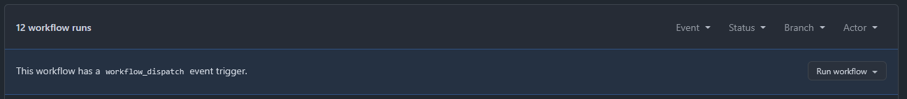
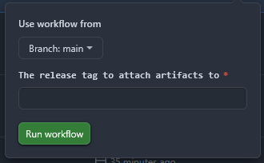
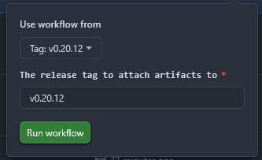

# scadnano Standalone Application

If you have not yet already, please read the main [README.md](../README.md).

## Development

To run the development version of scadnano standalone, run the following commands in the `scadnano/standalone` directory.

```shell
npm install
```

```shell
npm run dev
```

### Generating Icons (Not Required)

To generate icons for the Development build, run the following commands on your specific platform.

**Windows**

```shell
sh .\generate-icons.sh ../web/images/origami-icon-thin-seam-open-bottom.svg
```

**Linux/MacOS**
```shell
chmod +x ./generate-icons.sh
./generate-icons.sh ../web/images/origami-icon-thin-seam-open-bottom.svg
```

> You must have imagemagick installed for all platforms.

> For MacOS, you must also have iconutil installed.

## Building

Building an executable for scadnano should be easy. Run the following commands for your respective platform.

> The executable will be located in `scadnano/standalone/dist`.

| **Platform** |     **Command**     |    **Executable Name**    |          **Cache**          |
|:------------:|:-------------------:|:-------------------------:|:---------------------------:|
|  *Windows*   | `npm run build:win` |   `scadnano X.X.X.exe`    | `C:/Users/<user>/.scadnano` |
|   *MacOS*    | `npm run build:mac` |   `scadnano-X.X.X.dmg`    |  `/Users/<user>/.scadnano`  |
|   *Ubuntu*   | `npm run build:lin` | `scadnano-X.X.X.AppImage` |  `/home/<user>/.scadnano`   |

> Note: If you are running into a symlink error on Windows when trying to build, you need to enable windows developer mode. You can do this by going to **Settings -> Privacy & Security -> For Developers** and turning on **Developer Mode**.

## Uninstalling

To uninstall, simply delete the executable file and the **cache** directory in the above table based on the operating system you are using.

## Creating a Release

### Automatic Releases

A release should automatically be created once you rename the `tag` from "latest" to the desired release number on the release located [here](https://github.com/UC-Davis-molecular-computing/scadnano/releases).

### Manual Releases

If it is not done automatically, do the following.

1) Head to the [actions](https://github.com/UC-Davis-molecular-computing/scadnano/actions) tab

2) Click on **Build and Attach scadnano Release** located on the left.

3) Where it says "This workflow has a `workflow_dispatch` event trigger.", click on **run workflow**.



4) You should now see something similar to the following image.



5) Click on **Branch: main**, select the correct tag you want to create a standalone executable for. In this example, I will be using **v0.20.12**.



Copy the settings above based on the tag you chose.

6) Click on **Run workflow**.

At this point, it should successfully attach the executables for **Windows**, **Linux**, and **MacOS** to the release tag you specified.

## Important Notes

### Exiting the App

You may need to `CTRL/CMD + C` from the command-line to exit the electron app.