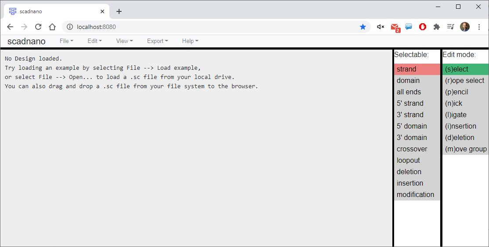
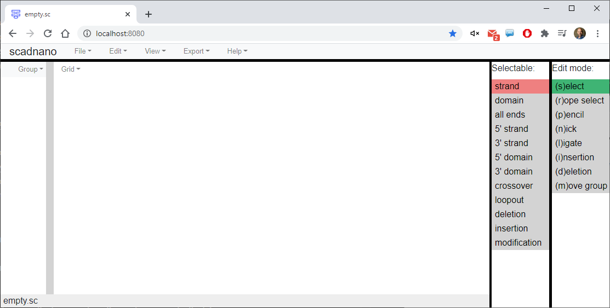
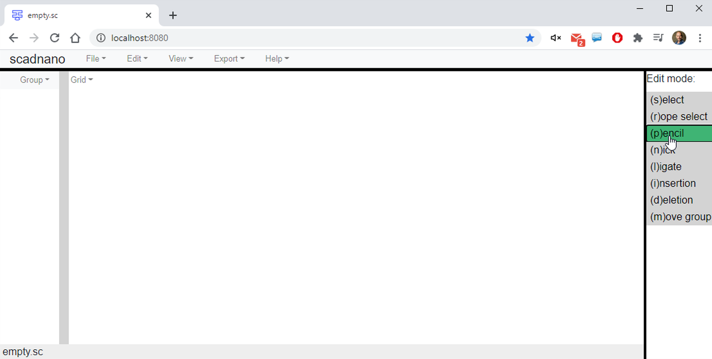
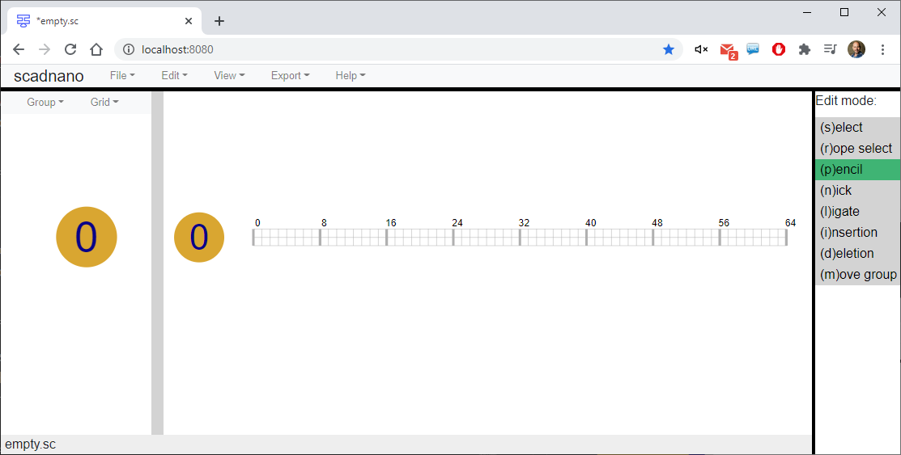
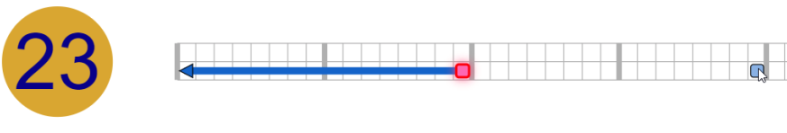
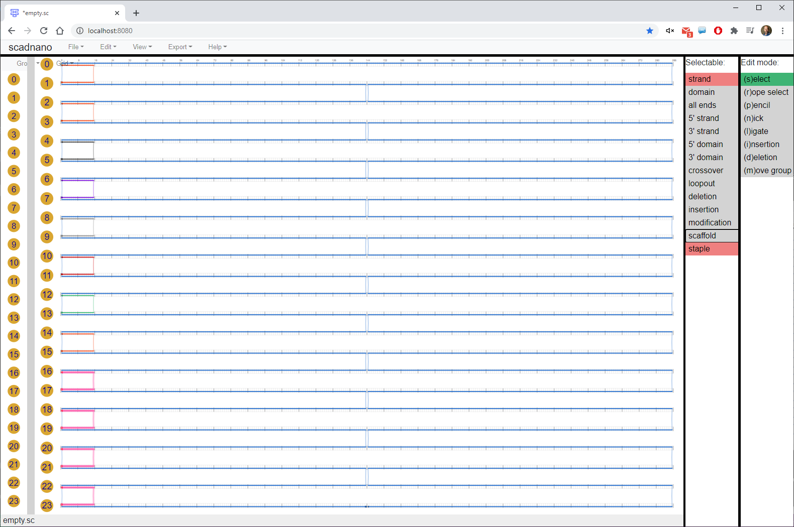
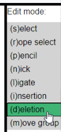
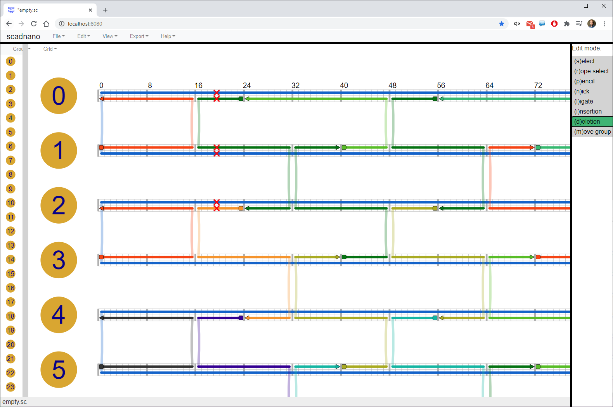

# scadnano web interface tutorial

The goal of this tutorial is to create a design for a 24-helix DNA origami rectangle, with "twist correction". (See [this paper](https://www.nature.com/articles/nchem.1070) for an explanation of twist correction in 2D DNA origami) 

See the [scripting tutorial](https://github.com/UC-Davis-molecular-computing/scadnano-python-package/blob/master/tutorial/tutorial.md) to see how to create this design programmatically using scadnano's [Python scripting library](https://github.com/UC-Davis-molecular-computing/scadnano-python-package).

The design will look like this when we are done:


The completed design is available as a [`.dna` file](https://raw.githubusercontent.com/UC-Davis-molecular-computing/scadnano/master/web/examples/output_designs/24_helix_origami_rectangle_twist_corrected.dna) readable by scadnano.


## Note about interface

The visual interface for scadnano is somewhat in flux. As a result, some of the screenshots in this tutorial, and some of the names of menu items, have changed since this tutorial was released. The functionality is all still there, but you may have to search around a bit in the menu to find it. Once the interface has stabilized a bit more, this tutorial will be updated to contain screenshots from the latest version of scadnano.


## Start

Open scadnano in your browser:
https://scadnano.org.
Currently only [Chrome](https://www.google.com/chrome/) 
or [Firefox](https://www.mozilla.org/en-US/firefox/)
are supported.

If you have never used scadnano before, you will see a screen similar to this:




## Load completed design to see what it looks like

Download the [completed design](https://raw.githubusercontent.com/UC-Davis-molecular-computing/scadnano/master/web/examples/output_designs/24_helix_origami_rectangle_twist_corrected.dna) and save it somewhere on your local file system.

Press the button next to the word "Load" at the top (in Chrome the button says "Choose file", whereas in other browsers it might say "Browse" or something different):


Choose the file you downloaded. (Alternatively, you can drag the file from your file browser onto the open scadnano page in your web browser.) The design should look similar to the first screenshot in the tutorial.


## Load empty design

Now, let's learn how to make this design ourselves. First, load an empty design by selecting "empty" from the "Load example" list:


After loading you should see this:



The left part is called the "side view" and the middle part is called the "main view".

First, save this design into a file by pressing the "Save" button. Name the file `24_helix_rectangle.dna`. Although the design is saved in your browser's local storage, be sure to save the file to disk periodically using the "Save" button.


## Create helices

To begin the design, we need to create helices. Click "(p)encil" under Edit mode (or press the p key):



Now click in the side view to create a helix. It will be labeled "0": 



You can use the mouse wheel or the two-finger motion on the touchpad to zoom out and see the whole helix in the main view:


You can also use the mouse/touchpad to click+drag and translate the image in the main view (and also the side view). Let's zoom in on helix 0 in both views:


In scadnano, a "helix" doesn't refer to a literal DNA double helix. It is a 1D set of locations called "offsets" (small white squares with gray borders) where DNA strands *could* go; each DNA base occupies one offset. By default the allowed offsets are 0 through 255. This zoom shows only the first 10 offsets of helix 0: 0, 1, 2, 3, 4, 5, 6, 7, 8, 9. When using the graphical interface to scadnano, you don't usually need to think much about these numbers, but they are important if you use the Python scripting library, because it uses these numerical offsets to specify where DNA strands begin and end.

Each helix has two "rows" of offsets. The top row always contains the strand whose 3' end is to the right of its 5' end; this strand is a "forward" strand. If there is another strand occupying some of the same offsets, it must be oriented in the opposite direction, i.e., its 3' end is to the left, a so-called "reverse" strand, and it will be drawn in the second row of the helix's offsets.

For now, just understand that moving to the right in the main view moves "into the screen" in the side view. Thus we can think of these as two 2D [projections](https://en.wikipedia.org/wiki/3D_projection) of the 3D space in which helices live. The side view shows the *x*-*y* plane (where moving in the *x* and/or *y* direction moves us between helices) and the main view shows "something like" the *y*-*z* plane (where moving in the *z* direction moves between DNA bases within a helix). The reason for the quotes around "something like" is that we actually will show every helix in the main view, even those with overlapping *x*-coordinates, so the main view is not formally a [linear projection](https://en.wikipedia.org/wiki/Projection_(linear_algebra)). See the [documentation](../README.md) for an explanation of how scadnano chooses helix positions in the main view.

Each helix has given an integer *index*, starting at 0 in the order you create them. (When creating helices with the scripting library or manually editing a scadnano `.dna` file, the helix indices can be any integers, but they must be unique to a helix.) By default, helices are drawn in the main view from top to bottom in order of their index, but this can be changed with a property called *helices_view_order* in the scripting library. It is [currently unsupported](https://github.com/UC-Davis-molecular-computing/scadnano/issues/36) to change the indices of existing helices or to edit *helices_view_order* directly in the web interface (the Python scripting library is needed, or direct editing of the `.dna` file), but these edits will be supported soon.

For now, we just have to be careful to add helices in the order we want them to appear in the main view. In both the main view and side view, we'd like them to appear 0,1,...,23 in order from top to bottom, so zoom out in the side view, and click in the side view to create 23 more helices below the first. If you mess up and click somewhere incorrectly, you can press Ctrl+Z to undo the last action (and Ctrl+Shift+Z to redo):


Finally, we need to ensure each helix has enough offsets for all the bases we will need. We will use a standard M13mp18 scaffold strand, of length 7249. We won't use all of it, but we'll use most of it. We have 7249 / 24 &asymp; 302, so length 304 should be enough for each helix. Right click on any helix in the main view and select "adjust length"


Enter a value of 304 for "maximum offset" and ensure "apply to all helices" is checked:


Click OK and the helix lengths should increase:


## Create first domain of scaffold

Now we show how to create DNA strands. As in cadnano, there's a distinction between a strand and a DNA sequence. Although scadnano allows you to assign DNA sequences to strands at any time, it is best to wait until the strand design is finalized to assign a DNA sequence to any strand. Many operations attempt to preserve the DNA that has been assigned so far, but many will be undefined (for example, lengthening a strand) and others may not be what you want (for example, copying an existing strand with DNA assigned and pasting it elsewhere, where it may require a different sequence).

Many DNA origami designs are quite repetitive. Thus, it is helpful to look at a mockup of the design you want and notice which strands are similar. Generally the fastest way to make a design is to identify a few repetitive strands and copy/paste them.

We start with the scaffold, which is the long blue strand in the first image. The routing pattern is quite repetitive, so we use this to our advantage. First, draw a strand on the left side of helix 0, in the forward direction (i.e., in the top row of the helix).

To do this, select pencil mode and click on helix 0, offset 8, on top, and drag the cursor to the right a few offsets (in this case we go to offset 15), then release the mouse button/touchpad:


This is a strand consisting of a single *domain*, which is a portion of a strand contiguous on a single helix. Later we will add *crossovers* to connect multiple domains on different helices into a single strand, but for now we simply draw the domains.

By default, strands are not scaffolds, meaning they are part of a design that doesn't represent DNA origami, or they are a DNA origami staple. To make this strand a scaffold, right click the strand and select "set as scaffold"


It should now turn blue:


Now, we need to lengthen the strand to cross most of the helix. We could have made it the full length while drawing it while fully zoomed out, but here we show how to change the length of an existing strand. Click "select" mode:


Different types of objects can be selectable or not, and some are mutually exclusive. For now, we want to be able to select 5'/3' ends of strands, so click those under "Select" (see the [README](../README.md) for a description of all the selection options):


Now we can select and drag ends of strands. Click the 3' end of the strand (the triangle on the right side) and drag it to the right:



which lengthens the strand:


Now, zoom out and repeat to lengthen it all the way to (almost) the end of the helix. When zoomed out, it can be difficult to click exactly on the 3' end, but it can be selected by pressing Shift and click-dragging the cursor to draw a gray box over the 3' end:


Unfortunately, to drag the 3' end, you do have to click it. So it may require zooming in and dragging a few times to get it all the way to the right:


Note that we stop a bit short on each side (leaving 8 unoccupied offsets on each side of the helix), because 304&middot;24 = 7296 is a bit too long for M13. Instead, we use length 288 on the helix, which if used on every helix will mean the scaffold will be length 288&middot;24 = 6912. (Actually it will be slightly shorter because of the deletions we add near the end.)


## Add other domains of scaffold

First, we copy and paste the strand we just made. To do this, remain in select edit mode, but choose "strand" under "Select":


Now click the strand and press Ctrl+C (the Ctrl key on Windows or Linux behaves the same as the Cmd key on Mac) to copy it.


Pressing Ctrl+V and moving the cursor gives you options where to paste the copy. Paste it to start at the same offset on helix 1, but to be a reverse strand, i.e., in the bottom row of the helix:


Observing the final design and noticing that these two so-called *domains* are connected by a crossover, at this point you might think we want to add those crossovers. Unfortunately, scadnano does not yet support *circular strands*, but adding those crossovers now would create a circular strand.

In this case, the domain we just drew should not span the entire length of the helix, but instead we want two domains that are adjacent in the middle. To split this domain into two, select the "nick" edit mode:


and click somewhere around the middle of the domain (if this doesn't get exactly to the middle; you can edit the exact offsets of the 5'/3' ends later by selecting and dragging them):


It's a bit harder to see, but here it is zoomed out:


Now, every other domain of the scaffold looks just like this, so we can copy/paste to get the rest. First, go to select mode with "strand" picked under select, copy the two reverse strands on helix 1 and paste them in the forward direction on helix 2 (when many strands are selected, the mouse cursor for the paste is assumed to be where the rightmost strand on the topmost helix is, so to paste you will want to go to the left side of the main view near the start of the helix):


## Link domains into one long scaffold strand

We will want the strands on helices 1 and 2 to be joined by crossovers in the middle, so let's add those now.

Select pencil mode and zoom in to the middle. Click on the 5' end of the left strand on helix 1. A "potential crossover" will be drawn wherever you drag the cursor:


Click on the 3' end of the strand directly below to connect them with a crossover:


This method enables any 5' end to be connected to any 3' end, as long as they are not already on the same strand (which would create a [circular strand](https://github.com/UC-Davis-molecular-computing/scadnano/issues/5).)

For the common case that you wish to connect ends at the same offset on adjacent helices, by putting the cursor over where a crossover would be drawn, a potential crossover appears that can be clicked to add the crossover:


When this is done, the design should look like this:


## Recursive copy/paste to complete the domains of the scaffold

We also want to connect the strands on helix 0 and 1 by crossovers near the edge of the helix, but not yet, because we aren't done copying the existing shorter strands.

Observe that this alternation of "reverse on helix 1, forward on helix 2" continues though helices 3 and 4, and helices 5 and 6, etc.

Switch back to *select* edit mode. At this point it might be simpler to select strands by zooming out and doing Shift+drag:


Select all four domains on helices, and copy/paste them to helices 3 and 4, respectively, ensuring that the top domains on helix 3 go in the reverse direction.


Switch to pencil mode, and connect domains on helices 2 and 3 by crossovers near the outer edges of the helices:


Now, recursively copy/paste: select all the domains on helices 1-5 and copy/paste them to helices 6-9 as before. Since this is all the domains except the topmost domai, one fast way is to press Ctrl+A to select all strands:


then Ctrl+click the top strand to unselect it:


Now copy/paste to helices 6-9:


In pencil mode, connect helices 4 and 5 by "outer" crossovers:


In select mode, copy paste strands from helices 1-8 to helices 9-16, and in pencil mode, connect helices 8 and 9 by outer crossovers:


Now, we have only 7 helices worth of strands to fill, and since they start with an odd helix (17), we want to copy strands starting at an odd helix going for 6 more helices. So we will copy the domains on helices 1-7 (or any consecutive helices starting with an odd index) and copy/paste them to helices 17-23. 

To do this, first temporarily disconnect the inner crossovers between helices 7 and 8 by changing to select edit, then pick "crossover" under "select":


Then select the "inner" crossovers between helices 7 and 8:


Press the delete key to delete them:


Now, enabling *strand* under "Select", copy the strands on helices 1-7, and paste them to helices 17-23:


Finally, in pencil mode add the final remaining crossovers (outer crossovers between helices 0-1, 16-17, and inner crossovers between helices 7-8):


The above steps could have been simplified somewhat by waiting until the domains were all drawn to add the crossovers, but then all 36 crossovers would have to be added manually. The total time in each case is probably comparable. It's your preference how much to try to plan ahead so that the copied substructures are more complete.


## add staples

**Note:** Due to a mistake, I forgot to add a few crossovers in the scaffold before adding the staples, so the scaffold below is missing a few crossovers that it should have. The scaffold you are working with should look like it does in the previous image, not like it does in several images below. I'll correct the images below eventually.

### edge staples

There aren't too many "shapes" of staples in a standard DNA origami rectangle. We follow the same strategy above of manually drawing one shape of staple and copy/pasting it to get the rest.

First, we add an edge staple by drawing a reverse domain on helix 0 and a forward domain on helix 1, both in the upper-left of the scaffold:


Then connect it by a crossover:


In staple select mode, copy and paste it to make a second edge staple:


Recursively copy/paste until there are 12 edge staples. In other words, copy/paste the current 2 edge staples to make 4:


Then copy/paste those 4 to make 8:


Then paste the same 4 again to make 12:




Follow the same strategy to make the right edge staples:


### seam staples

The staples near the "inner" crossovers (the region of the DNA origami called the "seam") are a bit different than the rest.

Draw two seam staples like this between helices 1 and 2:


Recursively copy/paste to get the rest:


### inner staples

Draw this staple on helices 0, 1, 2:


Most of the staples in the origami look like this. Recursively copy/paste it to fill in the rest of the "column" (width-16 region):


Now copy all of those newly added inner staples, and paste them just to the right, and one helix down. Note that the "polarity" of each strand will be reversed; i.e., each staple will be pointing the opposite direction.


The top and bottom are filled with a special staple type that more closely resembles the seam staples, shown here selected:


Finally, copy and paste the full columns to fill in the rest of the origami, except near the seam:


Copy and paste individual width-16 columns of staples to fill these in (shown here selected):


And manually draw the final few staples:


## Twist correction using deletions

Finally, twist correction is applied by added deletions at appropriate points. (See [this paper](https://www.nature.com/articles/nchem.1070) for an explanation of the need for twist correction and the mechanism of the solution.)

We could use the deletion edit mode:



And manually click where the deletions should go:



This would only take a few minutes, though it would be quite tedious. Furthermore, if we decided to change the location of the deletions slightly, we would have to go back through and re-click on all the deletions we want to remove and click new locations to add deletions.

This is a good opportunity to show how the Python scripting library can be used for repetitive tasks such as this. If you don't want to learn the Python scripting library just yet, continue clicking to add deletions until the design looks like the next full screenshot below, and skip the next subsection "Adding deletions using a Python script".


### Adding deletions using a Python script

First, follow the [installation instructions](https://github.com/UC-Davis-molecular-computing/scadnano-python-package).

Save the file using the "Save" button. Name it `24_helix_rectangle.dna`.

Next, put a Python file named `add_deletions_to_24_helix_rectangle.py` in the same folder, with this content:

```python
import scadnano as sc

def main():
    design = sc.DNADesign.from_scadnano_file('24_helix_rectangle.dna')
    return design

if __name__ == '__main__':
    design = main()
    design.write_scadnano_file(filename='24_helix_rectangle_twist_corrected.dna')
```

If you run the above code, it will simply read the design from `24_helix_rectangle.dna` and write the same design to `24_helix_rectangle_twist_corrected.dna`. Our goal now is to add the appropriate deletions in the script before writing the output.

We can simply loop over the helices and the offsets we need to do this. The three new lines are marked with `###`

```python
import scadnano as sc

def main():
    design = sc.DNADesign.from_scadnano_file('24_helix_rectangle.dna')
    for helix in range(24):                     ###
        for offset in range(27, 294, 48):       ###
            design.add_deletion(helix, offset)  ###
    return design

if __name__ == '__main__':
    design = main()
    design.write_scadnano_file(filename='24_helix_rectangle_twist_corrected.dna')
```

This code will only work for this particular design. One could imagine a more general algorithm that works on arbitrary DNA origami rectangles, making some assumptions about how they are designed. But this code is fairly easy to write for just this one specific design: we want deletions on every helix (outer `for` loop), starting after offset 27 and incrementing every 48 bases until the end (inner `for` loop).

If we now load the file `24_helix_rectangle_twist_corrected.dna`, we see this:


## Assign DNA sequence to scaffold

Finally, we complete the design by assigning a DNA sequence to the scaffold. This can also be done in the scripting library (as can any other edits), but we will do this in the graphical interface. Right-click the scaffold strand and select "assign DNA":


Paste this string into the text box:

```
TTCCCTTCCTTTCTCGCCACGTTCGCCGGCTTTCCCCGTCAAGCTCTAAATCGGGGGCTCCCTTTAGGGTTCCGATTTAGTGCTTTACGGCACCTCGAC
CCCAAAAAACTTGATTTGGGTGATGGTTCACGTAGTGGGCCATCGCCCTGATAGACGGTTTTTCGCCCTTTGACGTTGGAGTCCACGTTCTTTAATAGT
GGACTCTTGTTCCAAACTGGAACAACACTCAACCCTATCTCGGGCTATTCTTTTGATTTATAAGGGATTTTGCCGATTTCGGAACCACCATCAAACAGG
ATTTTCGCCTGCTGGGGCAAACCAGCGTGGACCGCTTGCTGCAACTCTCTCAGGGCCAGGCGGTGAAGGGCAATCAGCTGTTGCCCGTCTCACTGGTGA
AAAGAAAAACCACCCTGGCGCCCAATACGCAAACCGCCTCTCCCCGCGCGTTGGCCGATTCATTAATGCAGCTGGCACGACAGGTTTCCCGACTGGAAA
GCGGGCAGTGAGCGCAACGCAATTAATGTGAGTTAGCTCACTCATTAGGCACCCCAGGCTTTACACTTTATGCTTCCGGCTCGTATGTTGTGTGGAATT
GTGAGCGGATAACAATTTCACACAGGAAACAGCTATGACCATGATTACGAATTCGAGCTCGGTACCCGGGGATCCTCTAGAGTCGACCTGCAGGCATGC
AAGCTTGGCACTGGCCGTCGTTTTACAACGTCGTGACTGGGAAAACCCTGGCGTTACCCAACTTAATCGCCTTGCAGCACATCCCCCTTTCGCCAGCTG
GCGTAATAGCGAAGAGGCCCGCACCGATCGCCCTTCCCAACAGTTGCGCAGCCTGAATGGCGAATGGCGCTTTGCCTGGTTTCCGGCACCAGAAGCGGT
GCCGGAAAGCTGGCTGGAGTGCGATCTTCCTGAGGCCGATACTGTCGTCGTCCCCTCAAACTGGCAGATGCACGGTTACGATGCGCCCATCTACACCAA
CGTGACCTATCCCATTACGGTCAATCCGCCGTTTGTTCCCACGGAGAATCCGACGGGTTGTTACTCGCTCACATTTAATGTTGATGAAAGCTGGCTACA
GGAAGGCCAGACGCGAATTATTTTTGATGGCGTTCCTATTGGTTAAAAAATGAGCTGATTTAACAAAAATTTAATGCGAATTTTAACAAAATATTAACG
TTTACAATTTAAATATTTGCTTATACAATCTTCCTGTTTTTGGGGCTTTTCTGATTATCAACCGGGGTACATATGATTGACATGCTAGTTTTACGATTA
CCGTTCATCGATTCTCTTGTTTGCTCCAGACTCTCAGGCAATGACCTGATAGCCTTTGTAGATCTCTCAAAAATAGCTACCCTCTCCGGCATTAATTTA
TCAGCTAGAACGGTTGAATATCATATTGATGGTGATTTGACTGTCTCCGGCCTTTCTCACCCTTTTGAATCTTTACCTACACATTACTCAGGCATTGCA
TTTAAAATATATGAGGGTTCTAAAAATTTTTATCCTTGCGTTGAAATAAAGGCTTCTCCCGCAAAAGTATTACAGGGTCATAATGTTTTTGGTACAACC
GATTTAGCTTTATGCTCTGAGGCTTTATTGCTTAATTTTGCTAATTCTTTGCCTTGCCTGTATGATTTATTGGATGTTAATGCTACTACTATTAGTAGA
ATTGATGCCACCTTTTCAGCTCGCGCCCCAAATGAAAATATAGCTAAACAGGTTATTGACCATTTGCGAAATGTATCTAATGGTCAAACTAAATCTACT
CGTTCGCAGAATTGGGAATCAACTGTTATATGGAATGAAACTTCCAGACACCGTACTTTAGTTGCATATTTAAAACATGTTGAGCTACAGCATTATATT
CAGCAATTAAGCTCTAAGCCATCCGCAAAAATGACCTCTTATCAAAAGGAGCAATTAAAGGTACTCTCTAATCCTGACCTGTTGGAGTTTGCTTCCGGT
CTGGTTCGCTTTGAAGCTCGAATTAAAACGCGATATTTGAAGTCTTTCGGGCTTCCTCTTAATCTTTTTGATGCAATCCGCTTTGCTTCTGACTATAAT
AGTCAGGGTAAAGACCTGATTTTTGATTTATGGTCATTCTCGTTTTCTGAACTGTTTAAAGCATTTGAGGGGGATTCAATGAATATTTATGACGATTCC
GCAGTATTGGACGCTATCCAGTCTAAACATTTTACTATTACCCCCTCTGGCAAAACTTCTTTTGCAAAAGCCTCTCGCTATTTTGGTTTTTATCGTCGT
CTGGTAAACGAGGGTTATGATAGTGTTGCTCTTACTATGCCTCGTAATTCCTTTTGGCGTTATGTATCTGCATTAGTTGAATGTGGTATTCCTAAATCT
CAACTGATGAATCTTTCTACCTGTAATAATGTTGTTCCGTTAGTTCGTTTTATTAACGTAGATTTTTCTTCCCAACGTCCTGACTGGTATAATGAGCCA
GTTCTTAAAATCGCATAAGGTAATTCACAATGATTAAAGTTGAAATTAAACCATCTCAAGCCCAATTTACTACTCGTTCTGGTGTTTCTCGTCAGGGCA
AGCCTTATTCACTGAATGAGCAGCTTTGTTACGTTGATTTGGGTAATGAATATCCGGTTCTTGTCAAGATTACTCTTGATGAAGGTCAGCCAGCCTATG
CGCCTGGTCTGTACACCGTTCATCTGTCCTCTTTCAAAGTTGGTCAGTTCGGTTCCCTTATGATTGACCGTCTGCGCCTCGTTCCGGCTAAGTAACATG
GAGCAGGTCGCGGATTTCGACACAATTTATCAGGCGATGATACAAATCTCCGTTGTACTTTGTTTCGCGCTTGGTATAATCGCTGGGGGTCAAAGATGA
GTGTTTTAGTGTATTCTTTTGCCTCTTTCGTTTTAGGTTGGTGCCTTCGTAGTGGCATTACGTATTTTACCCGTTTAATGGAAACTTCCTCATGAAAAA
GTCTTTAGTCCTCAAAGCCTCTGTAGCCGTTGCTACCCTCGTTCCGATGCTGTCTTTCGCTGCTGAGGGTGACGATCCCGCAAAAGCGGCCTTTAACTC
CCTGCAAGCCTCAGCGACCGAATATATCGGTTATGCGTGGGCGATGGTTGTTGTCATTGTCGGCGCAACTATCGGTATCAAGCTGTTTAAGAAATTCAC
CTCGAAAGCAAGCTGATAAACCGATACAATTAAAGGCTCCTTTTGGAGCCTTTTTTTTGGAGATTTTCAACGTGAAAAAATTATTATTCGCAATTCCTT
TAGTTGTTCCTTTCTATTCTCACTCCGCTGAAACTGTTGAAAGTTGTTTAGCAAAATCCCATACAGAAAATTCATTTACTAACGTCTGGAAAGACGACA
AAACTTTAGATCGTTACGCTAACTATGAGGGCTGTCTGTGGAATGCTACAGGCGTTGTAGTTTGTACTGGTGACGAAACTCAGTGTTACGGTACATGGG
TTCCTATTGGGCTTGCTATCCCTGAAAATGAGGGTGGTGGCTCTGAGGGTGGCGGTTCTGAGGGTGGCGGTTCTGAGGGTGGCGGTACTAAACCTCCTG
AGTACGGTGATACACCTATTCCGGGCTATACTTATATCAACCCTCTCGACGGCACTTATCCGCCTGGTACTGAGCAAAACCCCGCTAATCCTAATCCTT
CTCTTGAGGAGTCTCAGCCTCTTAATACTTTCATGTTTCAGAATAATAGGTTCCGAAATAGGCAGGGGGCATTAACTGTTTATACGGGCACTGTTACTC
AAGGCACTGACCCCGTTAAAACTTATTACCAGTACACTCCTGTATCATCAAAAGCCATGTATGACGCTTACTGGAACGGTAAATTCAGAGACTGCGCTT
TCCATTCTGGCTTTAATGAGGATTTATTTGTTTGTGAATATCAAGGCCAATCGTCTGACCTGCCTCAACCTCCTGTCAATGCTGGCGGCGGCTCTGGTG
GTGGTTCTGGTGGCGGCTCTGAGGGTGGTGGCTCTGAGGGTGGCGGTTCTGAGGGTGGCGGCTCTGAGGGAGGCGGTTCCGGTGGTGGCTCTGGTTCCG
GTGATTTTGATTATGAAAAGATGGCAAACGCTAATAAGGGGGCTATGACCGAAAATGCCGATGAAAACGCGCTACAGTCTGACGCTAAAGGCAAACTTG
ATTCTGTCGCTACTGATTACGGTGCTGCTATCGATGGTTTCATTGGTGACGTTTCCGGCCTTGCTAATGGTAATGGTGCTACTGGTGATTTTGCTGGCT
CTAATTCCCAAATGGCTCAAGTCGGTGACGGTGATAATTCACCTTTAATGAATAATTTCCGTCAATATTTACCTTCCCTCCCTCAATCGGTTGAATGTC
GCCCTTTTGTCTTTGGCGCTGGTAAACCATATGAATTTTCTATTGATTGTGACAAAATAAACTTATTCCGTGGTGTCTTTGCGTTTCTTTTATATGTTG
CCACCTTTATGTATGTATTTTCTACGTTTGCTAACATACTGCGTAATAAGGAGTCTTAATCATGCCAGTTCTTTTGGGTATTCCGTTATTATTGCGTTT
CCTCGGTTTCCTTCTGGTAACTTTGTTCGGCTATCTGCTTACTTTTCTTAAAAAGGGCTTCGGTAAGATAGCTATTGCTATTTCATTGTTTCTTGCTCT
TATTATTGGGCTTAACTCAATTCTTGTGGGTTATCTCTCTGATATTAGCGCTCAATTACCCTCTGACTTTGTTCAGGGTGTTCAGTTAATTCTCCCGTC
TAATGCGCTTCCCTGTTTTTATGTTATTCTCTCTGTAAAGGCTGCTATTTTCATTTTTGACGTTAAACAAAAAATCGTTTCTTATTTGGATTGGGATAA
ATAATATGGCTGTTTATTTTGTAACTGGCAAATTAGGCTCTGGAAAGACGCTCGTTAGCGTTGGTAAGATTCAGGATAAAATTGTAGCTGGGTGCAAAA
TAGCAACTAATCTTGATTTAAGGCTTCAAAACCTCCCGCAAGTCGGGAGGTTCGCTAAAACGCCTCGCGTTCTTAGAATACCGGATAAGCCTTCTATAT
CTGATTTGCTTGCTATTGGGCGCGGTAATGATTCCTACGATGAAAATAAAAACGGCTTGCTTGTTCTCGATGAGTGCGGTACTTGGTTTAATACCCGTT
CTTGGAATGATAAGGAAAGACAGCCGATTATTGATTGGTTTCTACATGCTCGTAAATTAGGATGGGATATTATTTTTCTTGTTCAGGACTTATCTATTG
TTGATAAACAGGCGCGTTCTGCATTAGCTGAACATGTTGTTTATTGTCGTCGTCTGGACAGAATTACTTTACCTTTTGTCGGTACTTTATATTCTCTTA
TTACTGGCTCGAAAATGCCTCTGCCTAAATTACATGTTGGCGTTGTTAAATATGGCGATTCTCAATTAAGCCCTACTGTTGAGCGTTGGCTTTATACTG
GTAAGAATTTGTATAACGCATATGATACTAAACAGGCTTTTTCTAGTAATTATGATTCCGGTGTTTATTCTTATTTAACGCCTTATTTATCACACGGTC
GGTATTTCAAACCATTAAATTTAGGTCAGAAGATGAAATTAACTAAAATATATTTGAAAAAGTTTTCTCGCGTTCTTTGTCTTGCGATTGGATTTGCAT
CAGCATTTACATATAGTTATATAACCCAACCTAAGCCGGAGGTTAAAAAGGTAGTCTCTCAGACCTATGATTTTGATAAATTCACTATTGACTCTTCTC
AGCGTCTTAATCTAAGCTATCGCTATGTTTTCAAGGATTCTAAGGGAAAATTAATTAATAGCGACGATTTACAGAAGCAAGGTTATTCACTCACATATA
TTGATTTATGTACTGTTTCCATTAAAAAAGGTAATTCAAATGAAATTGTTAAATGTAATTAATTTTGTTTTCTTGATGTTTGTTTCATCATCTTCTTTT
GCTCAGGTAATTGAAATGAATAATTCGCCTCTGCGCGATTTTGTAACTTGGTATTCAAAGCAATCAGGCGAATCCGTTATTGTTTCTCCCGATGTAAAA
GGTACTGTTACTGTATATTCATCTGACGTTAAACCTGAAAATCTACGCAATTTCTTTATTTCTGTTTTACGTGCAAATAATTTTGATATGGTAGGTTCT
AACCCTTCCATTATTCAGAAGTATAATCCAAACAATCAGGATTATATTGATGAATTGCCATCATCTGATAATCAGGAATATGATGATAATTCCGCTCCT
TCTGGTGGTTTCTTTGTTCCGCAAAATGATAATGTTACTCAAACTTTTAAAATTAATAACGTTCGGGCAAAGGATTTAATACGAGTTGTCGAATTGTTT
GTAAAGTCTAATACTTCTAAATCCTCAAATGTATTATCTATTGACGGCTCTAATCTATTAGTTGTTAGTGCTCCTAAAGATATTTTAGATAACCTTCCT
CAATTCCTTTCAACTGTTGATTTGCCAACTGACCAGATATTGATTGAGGGTTTGATATTTGAGGTTCAGCAAGGTGATGCTTTAGATTTTTCATTTGCT
GCTGGCTCTCAGCGTGGCACTGTTGCAGGCGGTGTTAATACTGACCGCCTCACCTCTGTTTTATCTTCTGCTGGTGGTTCGTTCGGTATTTTTAATGGC
GATGTTTTAGGGCTATCAGTTCGCGCATTAAAGACTAATAGCCATTCAAAAATATTGTCTGTGCCACGTATTCTTACGCTTTCAGGTCAGAAGGGTTCT
ATCTCTGTTGGCCAGAATGTCCCTTTTATTACTGGTCGTGTGACTGGTGAATCTGCCAATGTAAATAATCCATTTCAGACGATTGAGCGTCAAAATGTA
GGTATTTCCATGAGCGTTTTTCCTGTTGCAATGGCTGGCGGTAATATTGTTCTGGATATTACCAGCAAGGCCGATAGTTTGAGTTCTTCTACTCAGGCA
AGTGATGTTATTACTAATCAAAGAAGTATTGCTACAACGGTTAATTTGCGTGATGGACAGACTCTTTTACTCGGTGGCCTCACTGATTATAAAAACACT
TCTCAGGATTCTGGCGTACCGTTCCTGTCTAAAATCCCTTTAATCGGCCTCCTGTTTAGCTCCCGCTCTGATTCTAACGAGGAAAGCACGTTATACGTG
CTCGTCAAAGCAACCATAGTACGCGCCCTGTAGCGGCGCATTAAGCGCGGCGGGTGTGGTGGTTACGCGCAGCGTGACCGCTACACTTGCCAGCGCCCT
AGCGCCCGCTCCTTTCGCTTTC
```


Be sure that "assign complement to bound strands" is checked. This is, in a sense, the primary function of cadnano and scadnano: to translate a desired abstract strand design, together with knowledge of a concrete DNA sequence for the scaffold, into the appropriate sequences for the staples to enable them to bind to the scaffold where we want.

Finally, check the box "show DNA":


When a large design displays its full DNA sequence, it can be slow to do things like zooming in and out, so normally it's a good idea to leave this box unchecked. But when checked, we can inspect the entire DNA sequence of both the scaffold and the staples.

And there we have it, the completed design:


## Exporting DNA sequences

Finally, to create a text file or Excel spreadsheet containing the staple sequences, click the button "Export DNA". A few default options are available. 

The Python scripting library gives more control than the web interface. Currently, some default options are available for both the web interface and the scripting library for making files that can be uploaded to the web site of the synthesis company IDT. In the future, scadnano will support export formats for other biotech companies.
