# scadnano web interface tutorial

The goal of this tutorial is to create a design for a 24-helix DNA origami rectangle, with "twist correction". (See [this paper](https://doi.org/10.1038/nchem.1070) for an explanation of twist correction in 2D DNA origami) 

See the [scripting tutorial](https://github.com/UC-Davis-molecular-computing/scadnano-python-package/blob/master/tutorial/tutorial.md) to see how to create this design programmatically using scadnano's [Python scripting library](https://github.com/UC-Davis-molecular-computing/scadnano-python-package).

The design will look like this when we are done:

The completed design is available as a [`.sc` file](https://raw.githubusercontent.com/UC-Davis-molecular-computing/scadnano/master/web/examples/24_helix_origami_rectangle_twist_corrected.sc) readable by scadnano.

## Start

Open scadnano in your browser:
https://scadnano.org.
Currently only [Chrome](https://www.google.com/chrome/) 
or [Firefox](https://www.mozilla.org/en-US/firefox/)
are supported.

If you have never used scadnano before, you will see a screen similar to this:

## Load completed design to see what it looks like

Download the [completed design](https://raw.githubusercontent.com/UC-Davis-molecular-computing/scadnano/master/example_designs/24_helix_rectangle.sc) and save it somewhere on your local file system.

In the menu at the top of the screen, click File&rarr;Open...

Choose the file you downloaded. (Alternatively, you can drag the file from your file browser onto the open scadnano page in your web browser.) The design should look similar to the first screenshot in the tutorial.

## Load empty design

Now, let's learn how to make this design ourselves. 

First, load an empty design by clicking File&rarr;Load example and selecting "empty" from the "Load example" list:

After loading you should see this:

The left part is called the "side view" and the middle part is called the "main view".

First, save this design into a file by pressing the "Save" button. Name the file `24_helix_rectangle.sc`. Although the design is saved in your browser's local storage, be sure to save the file to disk periodically using the "Save" button.

Unfortunately, due to browser security restrictions, there's no way for scadnano to figure out what filename you chose when saving, so the displayed filename in the browser tab will remain as empty.sc. If you want to have that displayed filename updated (for instance, to keep track of it with multiple tabs open), after saving, reload the file from disk. Then scadnano will know its name.

## Create helices

To begin the design, we need to create helices. Click "(p)encil" under Edit mode (or press the p key):

Now click in the side view to create a helix. 

You may notice that it will be zoomed in very far:

Use the mouse wheel or two finger scroll in both the side view on the left and the main view in the middle, to zoom out, and click and drag the background to pan the view left/right/up/down:

As you are editing the design, you may notice that the pan feature stops working, i.e., you click and drag the background, but it no longer moves. This is a known bug that is notoriously difficult to reproduce (and therefore difficult to diagnose and fix): https://github.com/UC-Davis-molecular-computing/scadnano/issues/163 If this happens while you are editing, the fix is to press the Ctrl or Shift key once, which should re-enable normal panning.

In scadnano, a "helix" doesn't refer to a literal DNA double helix. It is a 1D set of locations called "offsets" (small white squares with gray borders) where DNA strands *could* go; each DNA base occupies one offset. By default the allowed offsets are 0 through 63. When using the graphical interface to scadnano, you don't usually need to think much about these numbers, but they are important if you use the Python scripting library, because it uses these numerical offsets to specify where DNA strands begin and end.

Each helix has two "rows" of offsets. The top row always contains the strand whose 3' end is to the right of its 5' end; this strand is a "forward" strand. If there is another strand occupying some of the same offsets, it must be oriented in the opposite direction, i.e., its 3' end is to the left, a so-called "reverse" strand, and it will be drawn in the second row of the helix's offsets.

For now, just understand that moving to the right in the main view moves "into the screen" in the side view. Thus we can think of these as two 2D [projections](https://en.wikipedia.org/wiki/3D_projection) of the 3D space in which helices live. The side view shows the *x*-*y* plane (where moving in the *x* and/or *y* direction moves us between helices) and the main view shows "something like" the *y*-*z* plane (where moving in the *z* direction moves between DNA bases within a helix). The reason for the quotes around "something like" is that we actually will show every helix in the main view, even those with overlapping *x*-coordinates, so the main view is not formally a [linear projection](https://en.wikipedia.org/wiki/Projection_(linear_algebra)). See the [documentation](../README.md) for an explanation of how scadnano chooses helix positions in the main view.

Each helix has given an integer *index*, starting at 0 in the order you create them. (When creating helices with the scripting library or manually editing a scadnano `.sc` file, the helix indices can be any integers, but they must be unique to a helix.) By default, helices are drawn in the main view from top to bottom in order of their index, but this can be changed with a property called *helices_view_order* in the scripting library. It is [currently unsupported](https://github.com/UC-Davis-molecular-computing/scadnano/issues/36) to edit *helices_view_order* directly in the web interface (the Python scripting library is needed, or direct editing of the `.sc` file).

For now, we just have to be careful to add helices in the order we want them to appear in the main view. In both the main view and side view, we'd like them to appear 0,1,...,23 in order from top to bottom, so zoom out in the side view, and click in the side view to create 23 more helices below the first. If you mess up and click somewhere incorrectly, you can press Ctrl+Z to undo the last action (and Ctrl+Shift+Z to redo):

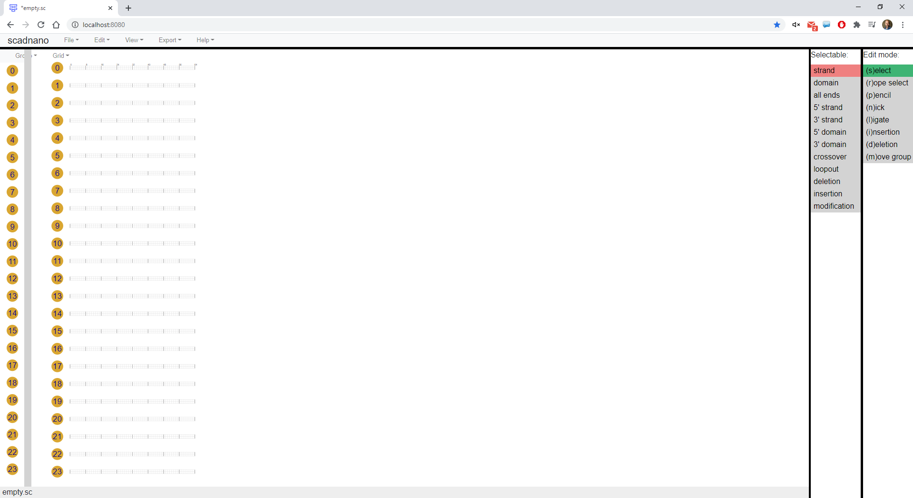

Finally, we need to ensure each helix has enough offsets for all the bases we will need. We will use a standard M13mp18 scaffold strand, of length 7249. We won't use all of it, but we'll use most of it. Right click on any helix in the main view and click "adjust max offset"

Enter a value of 288 for "maximum offset" and ensure "apply to all helices" is checked:

Click OK and the helix lengths should increase:

Using all 288 offsets on each of the 24 helices means the scaffold will be length 288&middot;24 = 6912, which is close to the full length 7249. (Actually it will be slightly shorter because of the "twist-correction deletions" we add near the end.)

## Create first domain of scaffold

Now we show how to create DNA strands. As in cadnano, there's a distinction between a strand and a DNA sequence. Although scadnano allows you to assign DNA sequences to strands at any time, it is best to wait until the strand design is finalized to assign a DNA sequence to any strand. Many operations attempt to preserve the DNA that has been assigned so far, but many will be undefined (for example, lengthening a strand) and others may not be what you want (for example, copying an existing strand with DNA assigned and pasting it elsewhere, where it may require a different sequence).

Many DNA origami designs are quite repetitive. Thus, it is helpful to look at a mockup of the design you want and notice which strands are similar. Generally the fastest way to make a design is to identify a few repetitive strands and copy/paste them.

We start with the scaffold, which is the long blue strand in the first image. The routing pattern is quite repetitive, so we use this to our advantage. First, draw a strand on the left side of helix 23 (the bottom helix), in the reverse direction (i.e., in the bottom row of the helix).

To do this, click pencil mode and click on helix 23, offset 0 (leftmost offset), on bottom, and drag the cursor to the right a few offsets (in this case we go to offset 15), then release the mouse button/touchpad:

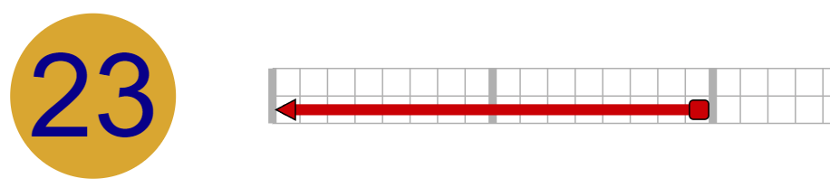

This is a strand consisting of a single *domain*, which is a portion of a strand contiguous on a single helix. Later we will add *crossovers* to connect multiple domains on different helices into a single strand, but for now we simply draw the domains.

By default, strands are not scaffolds, meaning they are part of a design that doesn't represent DNA origami, or they are a DNA origami staple. To make this strand a scaffold, right-click the strand and click "set as scaffold"

It should now turn blue:

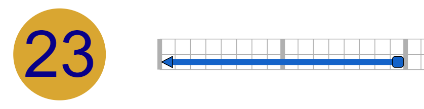

Now, we need to lengthen the strand to cross most of the helix. We could have made it the full length while drawing it while fully zoomed out, but here we show how to change the length of an existing strand. Click "select" mode:

Different types of objects can be selectable or not, and some are mutually exclusive. When in select mode (or rope select mode, see [here](https://github.com/UC-Davis-molecular-computing/scadnano/releases/tag/v0.13.0) for more information about that mode), a list will appear of all the potentially selectable objects. 

Right now, we want to be able to select 5'/3' ends of strands. 5' and 3' can be independently selectable or not, but a quick way to make all 5' and 3' ends selectable (including those that are not at the end of the strand, but are at the end of a domain at a crossover between two domains), is to click "all ends" under "Selectable":

See the [README](../README.md) for a description of all the selection options.

Now we can select and drag ends of strands. Click the 5' end of the strand (the square on the right side) and drag it to the right:

which lengthens the strand:

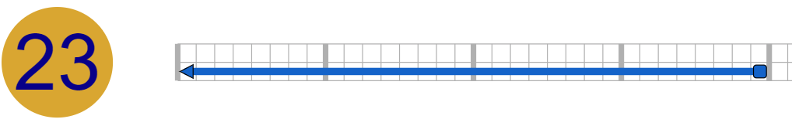

To unselect all items, unlike most drawing programs, you don't simply click on the background. Instead, press the Esc button to clear all selections. (This helps when you want to keep several objects selected, but retain the ability to click and drag the background to help pan around the view.)

Now, zoom out and repeat to lengthen it all the way to the right end of the helix. When zoomed out, it can be difficult to click exactly on the 3' end, but it can be selected by pressing Shift and click-dragging the cursor to draw a gray box over the 3' end:

Unfortunately, to drag the 3' end, you do have to click it. So it may require zooming in and dragging a few times to get it all the way to the right:

You can also Shift-click (or Shift + drag selection box) on items to add them to the selection one at a time, and Ctrl-click (or Ctrl + drag selection box) to toggle whether they are selected.

## Add other domains of scaffold

First, we copy and paste the strand we just made. To do this, remain in select edit mode, but choose "strand" under "Selectable":

Now click the strand and press Ctrl+C (the Ctrl key on Windows or Linux behaves the same as the Cmd key on Mac) to copy it.

Pressing Ctrl+V and moving the cursor gives you options where to paste the copy. Paste it to start at the same offset on helix 22 (the one above), but to be a forward strand, i.e., in the top row of the helix:

At this point, we add nicks to both domains, since the bottom one will have the 5' and 3' ends of the whole scaffold strand, and the top one needs to be nicked to add the crossovers to the domains above it (which we haven't created yet).

To split these domains into two, select the "nick" edit mode. To help see where offset 144 is, first click on *View&rarr;Display major tick offsets ... on all helices*:

Then click at offset 144, around the middle of the domain.

It's a bit harder to see, but here it is zoomed out:

## Note on circular strands

We added a nick to the bottom scaffold domain, and when we are done editing the scaffold, that will be where the 5' and 3' ends of the whole strand are. Actually, the real M13 strand is circular, i.e., it has no 5' or 3' end. So why do we design it as a linear strand in scadnano? Although scadnano [supports circular strands](https://github.com/UC-Davis-molecular-computing/scadnano/releases/tag/v0.13.4), it is typically best to avoid them in final designs, because certain operations, such as assigning DNA sequences, are not well-defined on circular strands.

## Link domains into one long scaffold strand

We will want the strands on helices 1 and 2 to be joined by crossovers in the middle, so let's add those now.

Select pencil mode and zoom in to the middle. Click on the 5' end of the left strand on helix 22. A "potential crossover" will be drawn wherever you drag the cursor:

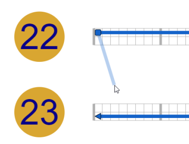

Click on the 3' end of the strand directly below to connect them with a crossover:

This method enables any 5' end to be connected to any 3' end.

Now let's connect the rightmost ends of domains on these helices as well. There's a very common case for crossovers:
you wish to connect ends at the same offset on adjacent helices, on strands pointing in opposite directions. To do this, by putting the cursor over where a crossover would be drawn, a potential crossover appears that can be clicked to add the crossover:

When this is done, the design should look like this:

Now, every other domain of the scaffold looks just like these, so we can copy/paste to get the rest. First, go to select mode with "strand" picked under select, copy all the strands we've drawn so far. This can be done by dragging a selection box (press Shift+click+drag), or simply by pressing Ctrl+A while in select edit mode, with strands selectable. 

Make sure that you have clicked somewhere in the main view first, and are in select edit mode. Otherwise the browser's normal Ctrl+A select all functionality will be used, and instead it will select a lot of the text in the browser window, like this:

To get rid of the blue highlighting, just click anywhere in the menu area, e.g., where the cursor is shown here:

Press Ctrl+C to copy. To paste put the cursor at the leftmost offset of helix 20, in the forward direction, i.e., on the top part of the helix:

When you copy several strands, when pasting them, the cursor tracks where is the leftmost offset of the topmost domain.

Finally, add crossovers connected the ends at offsets in the middle of helices 21 and 22 (the region of the origami called the "*seam*"):

## Recursive copy/paste to complete the domains of the scaffold

The remainder of the scaffold looks just like what we have drawn so far. We can "recursively copy paste" to quickly generate the rest of the scaffold.

Switch back to *select* edit mode. At this point it might be simpler to select strands by zooming out and doing Shift+drag:

Copy paste them to the next four helices above (taking care to match the forward/reverse pattern of the existing domains; they should alternate forward on even helices and reverse on odd helices):

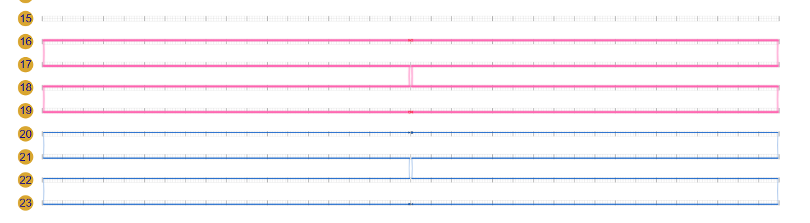

Switch to pencil mode, and connect domains on helices 19 and 20 by crossovers near the seam:

Now, recursively copy/paste again: select all the domains on helices 16-23 and copy/paste them to helices 8-15:

We will connect helices 15 and 16 with crossovers at the seam, but before doing that, we paste one more time (you don't have to copy again; it is possible to paste the same strand(s) several times in a row) to the remaining helices 0-7:

*Now*, connect the domains on helices 7 and 8, and those on helices 15 and 16, with crossovers at the seam:

Finally, to join the domains separated by a nick in the middle of the top helix, switch to *ligate* edit mode:

and click one of the ends where that nick is:

which joins them into a single strand:

Now the scaffold is complete!

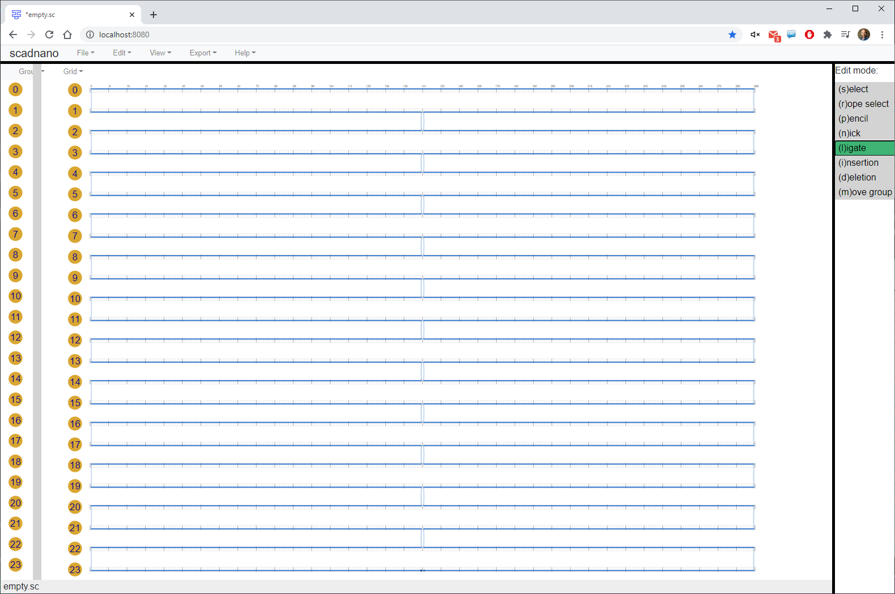

## add staples

### edge staples

There aren't too many "shapes" of staples in a standard DNA origami rectangle. We follow the same strategy above of manually drawing one shape of staple and copy/pasting it to get the rest.

First, we add an edge staple by drawing a reverse domain on helix 0 and a forward domain on helix 1, both in the upper-left of the scaffold:

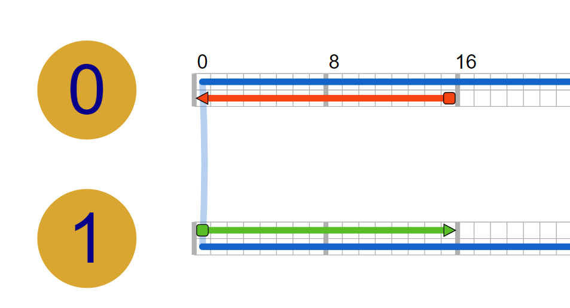

Then connect it by a crossover:

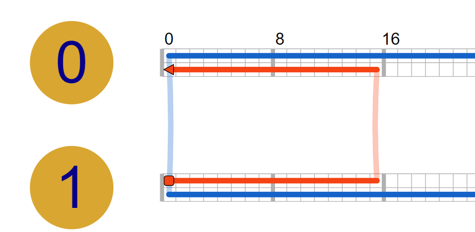

In staple select mode, copy and paste it to make a second edge staple:

By default, copy-pasted strands keep the color of the original. To generate a new color for each pasted strand, uncheck *View&rarr;Pasted strands keep original color*

Recursively copy/paste until there are 12 edge staples. In other words, copy/paste the current 2 edge staples to make 4:

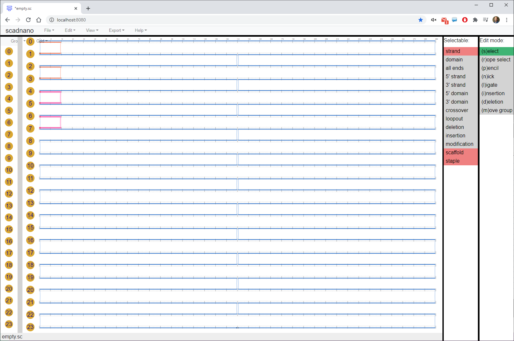

Then copy/paste those 4 to make 8:

Then paste the same 4 again to make 12:

### strand reflections

To make the right edge staples, we can copy the left edge staples and paste them on the right:

However, the crossovers are on the wrong side. To fix this, right click any of the edge staples, while they are still all selected, and pick *reflect horizontally (reverse vertical polarity)*

This will flip them around:

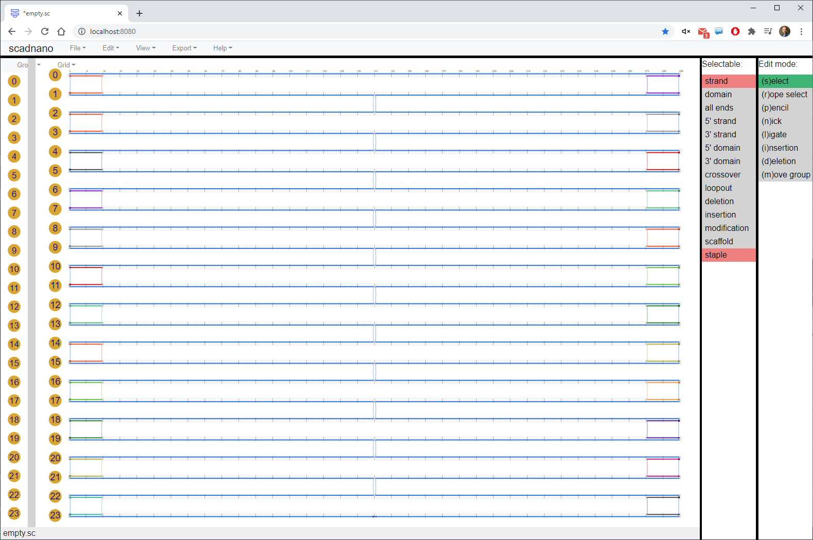

The other horizontal reflection option *reflect horizontally* (without reversing vertical polarity) would have a similar effect, but it would have all the strands pointing in the opposite direction. So in fact if you tried this, it would not be allowed, because the scaffold strand is already occupying that direction on those helices. It would generate an error message like this:

### seam staples

The staples near the "inner" crossovers (the region of the DNA origami called the "seam") are a bit different than the rest.

Draw two seam staples like this between helices 1 and 2:

Recursively copy/paste to get the rest. Note that because they start down one helix compared to the edge staples, there will be 11 total instead of 12:

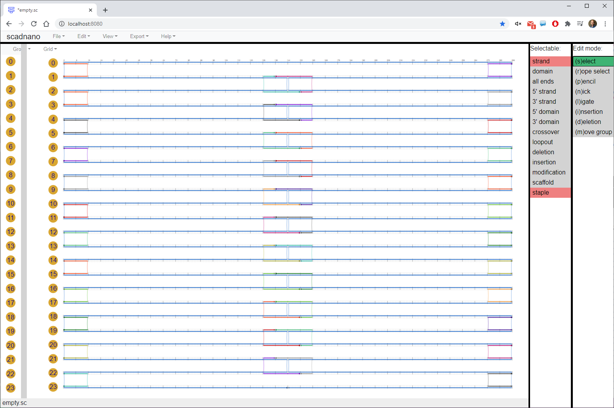

### inner staples

Next to the left edge staples, draw this staple on helices 0, 1, 2:

Most of the staples in the origami look like this. Recursively copy/paste it to fill in the rest of the "column" (width-16 region):

Now copy all of those newly added inner staples, and paste them just to the right, and one helix down. Note that the "polarity" of each strand will be reversed; i.e., each staple will be pointing the opposite direction.

The top and bottom are filled with a special staple type that more closely resembles the seam staples, shown here selected:

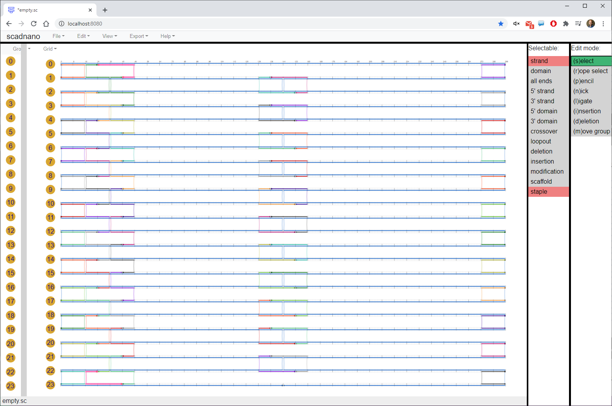

Finally, copy and paste the full columns to fill in the rest of the origami, except near the seam:

Copy and paste individual width-16 columns of staples to fill these in (shown here selected):

And manually draw the final few staples:

## Twist correction using deletions

Finally, twist correction is applied by added deletions at appropriate points. (See [this paper](https://www.nature.com/articles/nchem.1070) for an explanation of the need for twist correction and the mechanism of the solution.)

We use the deletion edit mode:

And manually click where the deletions should go:

This would only take a few minutes, though it would be quite tedious. Since adding full "columns" of deletions like this is common, there is a shortcut to do it: press Ctrl while clicking. This will add a deletion to *every* helix at the offset where you clicked:

Do this every 48 offsets until the design looks like this:

## Assign DNA sequence to scaffold

Finally, we complete the design by assigning a DNA sequence to the scaffold. This can also be done in the scripting library (as can any other edits), but we will do this in the graphical interface. Right-click anywhere on the scaffold strand and select "assign DNA":

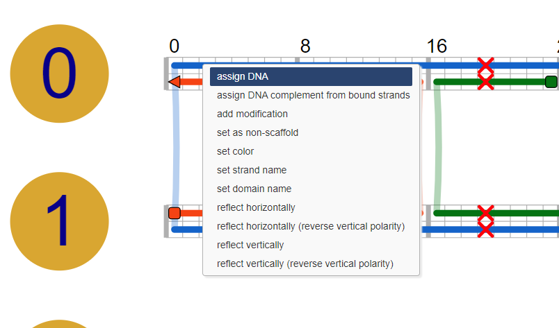

The default option is to choose your own DNA sequence to paste into the textbox, but for the common case that you want to assign the M13 sequence to the strand, it is provided for you, so click *use predefined DNA sequence*:

Be sure that "assign complement to bound strands" is checked. This is, in a sense, the primary function of cadnano and scadnano: to translate a desired abstract strand design, together with knowledge of a concrete DNA sequence for the scaffold, into the appropriate sequences for the staples to enable them to bind to the scaffold where we want.

Finally, check the box *View&rarr;Show DNA sequences*:

When a large design displays its full DNA sequence, it can be slow to do things like zooming in and out, so normally it's a good idea to leave this box unchecked. But when checked, we can inspect the entire DNA sequence of both the scaffold and the staples.

And there we have it, the completed design:

## Exporting DNA sequences

Finally, to create a text file or Excel spreadsheet containing the staple sequences, click *Export&rarr;DNA sequences*: 

A few default options are available. For example, to create an Excel spreadsheet that can be used to order staples from the synthesis company IDT in 96-well plates, with strands sorted by the positions of their 5' ends (in "column major" order, meaning first all the left-most staples in order from top to bottom, the the ones to the left of those, then to the left of those, etc.), choose these options:

The Python scripting library gives more control than the web interface for controlling what is exported.
