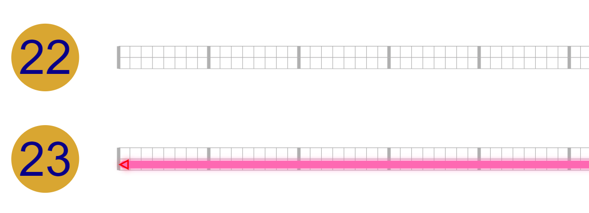

# scadnano web interface tutorial

The goal of this tutorial will be to create a design for a 24-helix DNA origami rectangle, with "twist correction". It will look like this when we are done:

TODO

## Start

Open scadnano in your browser : 
https://web.cs.ucdavis.edu/~doty/scadnano/.
Currently only [Chrome](https://www.google.com/chrome/) 
or [Firefox](https://www.mozilla.org/en-US/firefox/)
are supported.

If you have never used scadnano before, you will see a screen similar to this:

## Load design

You can load one of the example designs, or load a file from your local file system.

Let's load an empty design by selecting "empty" from the "Load example" list:

After loading you should see this:

The left part is called the "side view" and the right part is called the "main view".

## Create helices

To begin the design, we need to create helices. Click "(p)encil" under Edit mode (or press the p key):

Now click in the side view to create a helix. It will be labeled "0": 

You can use the mouse wheel or the two-finger motion on the touchpad to zoom out and see the whole helix in the main view:

You can also use the mouse/touchpad to pan the image in the main view (and also the side view). Let's zoom in on helix 0 in both views:

In scadnano, a "helix" doesn't refer to a literal DNA double helix. It is a 1D set of locations where DNA strands can go. A helix has a number of "offsets" where DNA bases can go; by default the allowed offsets are 0 through 255. This zoom shows only the first 10 offsets of helix 0: 0, 1, 2, 3, 4, 5, 6, 7, 8, 9. When using the graphical interface to scadnano, you don't usually need to think much about these numbers, but they are important if you use the Python scripting library, because it uses these numerical offsets to specify where DNA strands begin and end.

Each helix has two "rows" of offsets. The top row always contains the strand whose 3' end is to the right; this strand is a "forward" strand. If there is another strand occupying some of the same offsets, it must be moving in the opposite direction, i.e., its 3' end is to the left, a so-called "reverse" strand, and it will be drawn in the second row of the helix's offsets.

For now, just understand that moving to the right in the main view moves "into the screen" in the side view. Thus we can think of these as two 2D projections of the 3D space in which helices live. The side view shows the *x*-*y* place (where moving in the *x* and/or *y* direction moves us between two helices) and the main view shows "something like" the *y*-*z* plane (where moving in the *z* direction moves between DNA bases along a helix). The reason for the quotes around "something like" is that we actually will show every helix in the main view, even those with overlapping *x*-coordinates, so the main view is not exactly a projection.

Each helix has given an integer *index*, starting at 0 in the order you create them. If a helix is deleted, all larger indices are decremented to ensure that they are numbered 0, ..., *h* - 1, where *h* is the number of helices. By default, helices are drawn in the main view from top to bottom in order of their index, but this can be changed with a property called *helices_view_order* in the scripting library. It is [currently unsupported](https://github.com/UC-Davis-molecular-computing/scadnano/issues/36) to change the indices of existing helices or to edit *helices_view_order* directly in the web interface, but these will be supported soon.

For now, we just have to be careful to add helices in the order we want them to appear in the main view. In both the main view and side view, we'd like them to appear 0,1,...,23 in order from top to bottom, so zoom out in the side view, and click in the side view to create 23 more helices below the first. If you mess up and click somewhere incorrectly, you can press Ctrl+Z to undo the last action (and Ctrl+Shift+Z to redo):

Finally, we need to ensure each helix has enough offsets for all the bases we will need. We will use a standard M13mp18 scaffold strand, of length 7249. We won't use all of it, but we'll use most of it. We have 7249 / 24 &asymp; 302, so length 304 should be enough for each helix. Right click on any helix in the main view and select "adjust length"

Enter a value of 304 for "maximum offset" and ensure "apply to all helices is checked:

Click OK and the helix lengths should increase:

## Creating first strand

Now we show how to create DNA strands. As in cadnano, there's a distinction between a strand and a DNA sequence. Although scadnano allows you to assign DNA sequences to strands at any time, it is best to wait until the strand design is finalized to assign DNA. Many operations attempt to preserve the DNA that has been assigned so far, but many will be undefined (for example, lengthening a strand with DNA) and others may not be what you want (for example, copying an existing strand with DNA assigned and pasting it elsewhere, where it may require a different sequence).

Many DNA origami designs are quite repetitive. Thus, it is helpful to look at a mockup of the design you want and notice which strands are similar. Generally the fastest way to make a design is to identify a few repetitive strands and copy/paste them.

We start with the scaffold, which is the long blue strand in the first image. The routing pattern is quite repetitive, so we use this to our advantage. First, draw a strand on the left side of helix 0, in the forward direction (i.e., in the top row of the helix).

To do this, select pencil mode and click on helix 0, offset 8, on top, and drag the cursor to the right a few offsets (in this case we go to offset 15), then release the mouse button/touchpad:

This is a strand consisting of a single *substrand*, which is a portion of a strand contiguous on a single helix. Later we will add *crossovers* to connect multiple substrands on different helices into a single strand, but for now we simply draw the substrands.

By default, strands are not scaffolds, meaning they are part of a design that doesn't represent DNA origami, or they are a DNA origami staple. To make this strand a scaffold, right click the strand and select "set as scaffold"

It should now turn blue:

Now, we need to lengthen the strand to cross most of the helix. We could have made it the full length while drawing it while fully zoomed out, but here we show how to change the length of an existing strand. Click "select" mode:

Different types of objects can be selectable or not, and some are mutually exclusive. For now, we want to be able to select 5'/3' ends of strands, so click those (see the [README](../README.md) for a description of all the selection options):

Now we can select and drag ends of strands. Click the 3' end of the strand (the triangle on the right side) and drag it to the right:

which lengthens the strand:

Now, zoom out and repeat to lengthen it all the way to (almost) the end of the helix. When zoomed out, it can be difficult to click exactly on the 3' end, but it can be selected by pressing Shift and click-dragging the cursor to draw a gray box over the 3' end:

Unfortunately, to drag the 3' end, you do have to select it. So it may require zooming in and dragging a few times to get it all the way to the right:

Note that we stop a bit short on either end, because 304&middot;24 = 7296 is a bit too long for M13. Instead, we use length 288 on the helix, which if used on every helix will mean the scaffold will be length 288&middot;24 = 6912.

## Adding other substrands of scaffold

First, we copy and paste the strand we just made. To do this, remain in select edit mode, but choose "strand" under "Select":

Now click the strand and press Ctrl+C (or Cmd+C on Mac) to copy it.

Pressing Ctrl+V and moving the cursor gives you options where to paste the copy. Paste it to start at the same offset on helix 1, but to be a reverse strand, i.e., in the bottom row of the helix:

Observing the final design and noticing that these two so-called *substrands* are connected by a crossover, at this point you might think we want to add those crossovers. Unfortunately, scadnano does not yet support *circular strands*, and add those crossovers now would create a circular strand.

Instead, generally it is best to draw all the substrands you want first before connecting them with crossovers. In this case, the substrand we just drew should not span the entire length of the helix, but instead we want two substrands that are adjacent in the middle. To split this substrand into two, select the "nick" edit mode:

and click somewhere around the middle of the substrand (we can edit the exact points later):

It's a bit harder to see, but here it is zoomed out:

Now, every other substrand of the scaffold looks just like this, so we can copy/paste to get the rest. First, go to select mode with "strand" picked under select, copy the two reverse strands on helix 1 and paste them in the forward direction on helix 2 (when many strands are selected, the mouse cursor for the paste is assumed to be where the rightmost strand on the topmost helix is, so to paste you will want to go to the left side of the main view near the start of the helix):

Now, observe that this alternation of "reverse on helix 1, forward on helix 2" continues though helices 3 and 4, and helices 5 and 6, etc.

At this point it might be simpler to select strands by zooming out and doing Shift+drag:

Select all four substrands on helices, and copy/paste them to helices 3 and 4, respectively, ensuring that the top substrands on helix 3 go in the reverse direction.

Now, recursively copy/paste: select all the substrands on helices 1-5 and copy/paste them to helices 6-9 as before. Since this is all the substrands except the topmost substrand, one simple way is to press Ctrl+A to select all strands, 

then Ctrl+click the top strand to unselect it:

Now copy/paste to helices 6-9:

Do this again with all substrands but the top to cover helices 9-16:

The last step should not involve copying more strands. We have only 7 helices worth of strands to fill, and since they start with an odd helix (17), we want to copy strands starting at an odd helix going for 6 more helices. So copy the substrands on helices 1-7 (or any consecutive helices starting with an odd index) and copy/paste them to helices 17-23:

## Linking substrands into one long scaffold strand

Now, we need to add crossovers to link the various strands into a single scaffold strand.

